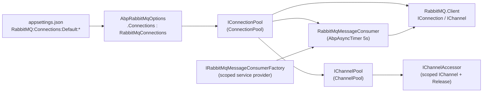

`Volo.Abp.RabbitMQ` is the thinnest possible layer over the official `RabbitMQ.Client` driver. It does four things:

1. Binds `AbpRabbitMqOptions` to the `"RabbitMQ"` configuration section so connection factories can be declared in `appsettings.json`.
2. Pools `IConnection` instances by name (`IConnectionPool` / `ConnectionPool`).
3. Pools `IChannel` instances per channel name, with per-item locks so the same channel can be safely re-acquired (`IChannelPool` / `ChannelPool`).
4. Provides a consumer (`RabbitMqMessageConsumer`) that re-declares its exchange, queue and bindings on a 5-second `AbpAsyncTimer` — the recovery mechanism that lets ABP survive broker restarts even with `AutomaticRecoveryEnabled = false`.

This page walks through each of those pieces with file references into `framework/src/Volo.Abp.RabbitMQ/Volo/Abp/RabbitMQ/`.

## Package layout

```text
framework/src/Volo.Abp.RabbitMQ/Volo/Abp/RabbitMQ/
├── AbpRabbitMqModule.cs
├── AbpRabbitMqOptions.cs
├── ChannelPool.cs
├── ConnectionPool.cs
├── ExchangeDeclareConfiguration.cs
├── IChannelAccessor.cs
├── IChannelPool.cs
├── IConnectionPool.cs
├── IRabbitMqMessageConsumer.cs
├── IRabbitMqMessageConsumerFactory.cs
├── IRabbitMqSerializer.cs
├── QueueBindType.cs
├── QueueDeclareConfiguration.cs
├── RabbitMqConnections.cs
├── RabbitMqConsts.cs
├── RabbitMqMessageConsumer.cs
├── RabbitMqMessageConsumerFactory.cs
└── Utf8JsonRabbitMqSerializer.cs
```

## How the pieces fit



`ConnectionPool` owns the SDK `IConnection` objects. `ChannelPool` borrows from `ConnectionPool`, multiplexing channels by name. `RabbitMqMessageConsumer` does *not* go through `ChannelPool` — it asks `ConnectionPool` for a connection and creates a dedicated `IChannel` for itself, because consumers need a long-lived channel they fully control.

## Module: `AbpRabbitMqModule`

```csharp
// framework/src/Volo.Abp.RabbitMQ/Volo/Abp/RabbitMQ/AbpRabbitMqModule.cs
[DependsOn(
    typeof(AbpJsonModule),
    typeof(AbpThreadingModule)
    )]
public class AbpRabbitMqModule : AbpModule
{
    public override void ConfigureServices(ServiceConfigurationContext context)
    {
        var configuration = context.Services.GetConfiguration();
        Configure<AbpRabbitMqOptions>(configuration.GetSection("RabbitMQ"));
        Configure<AbpRabbitMqOptions>(options =>
        {
            foreach (var connectionFactory in options.Connections.Values)
            {
                connectionFactory.AutomaticRecoveryEnabled = false;
            }
        });
    }

    public async override Task OnApplicationShutdownAsync(ApplicationShutdownContext context)
    {
        await context.ServiceProvider
            .GetRequiredService<IChannelPool>()
            .DisposeAsync();

        await context.ServiceProvider
            .GetRequiredService<IConnectionPool>()
            .DisposeAsync();
    }
}
```

Two things to call out:

1. **`AutomaticRecoveryEnabled` is forced off** for every connection factory after binding. ABP runs its own recovery loop in `RabbitMqMessageConsumer` (a 5-second `AbpAsyncTimer`), and the SDK's built-in recovery interacts badly with that loop — both would attempt to re-declare entities and re-bind queues.
2. **Channels are disposed before connections** on shutdown. The order is important: disposing a connection first would already invalidate every channel, and `ChannelPool.DisposeAsync` would log noisy errors.

<Warning>
  If you wire up `AbpRabbitMqOptions` *after* the module's `ConfigureServices` runs (for example in `PreConfigureServices` of a downstream module), make sure your own configurator also sets `AutomaticRecoveryEnabled = false`. The post-configure pass above happens at module-load time, not per-resolve.
</Warning>

## Options: `AbpRabbitMqOptions` + `RabbitMqConnections`

```csharp
// framework/src/Volo.Abp.RabbitMQ/Volo/Abp/RabbitMQ/AbpRabbitMqOptions.cs
public class AbpRabbitMqOptions
{
    public RabbitMqConnections Connections { get; }

    public AbpRabbitMqOptions()
    {
        Connections = new RabbitMqConnections();
    }
}
```

```csharp
// framework/src/Volo.Abp.RabbitMQ/Volo/Abp/RabbitMQ/RabbitMqConnections.cs
[Serializable]
public class RabbitMqConnections : Dictionary<string, ConnectionFactory>
{
    public const string DefaultConnectionName = "Default";

    [NotNull]
    public ConnectionFactory Default {
        get => this[DefaultConnectionName];
        set => this[DefaultConnectionName] = Check.NotNull(value, nameof(value));
    }

    public RabbitMqConnections()
    {
        Default = new ConnectionFactory();
    }

    public ConnectionFactory GetOrDefault(string connectionName)
    {
        if (TryGetValue(connectionName, out var connectionFactory))
        {
            return connectionFactory;
        }

        return Default;
    }
}
```

`ConnectionFactory` is the standard `RabbitMQ.Client` type, which means everything it exposes (`HostName`, `UserName`, `Password`, `VirtualHost`, `Port`, `Ssl`, …) is available via configuration binding.

### Configuration shape

<CodeGroup>

```json appsettings.json
{
  "RabbitMQ": {
    "Connections": {
      "Default": {
        "HostName": "rabbitmq",
        "UserName": "guest",
        "Password": "guest",
        "VirtualHost": "/",
        "Port": 5672
      }
    }
  }
}
```

```csharp Code-first (multi-broker)
Configure<AbpRabbitMqOptions>(options =>
{
    options.Connections.Default.HostName = "rabbitmq-primary";
    options.Connections.Default.UserName = "events";
    options.Connections.Default.Password = "...";

    options.Connections["audit"] = new ConnectionFactory
    {
        HostName = "rabbitmq-audit",
        UserName = "audit",
        Password = "..."
    };
});
```

```json Multi-host cluster
{
  "RabbitMQ": {
    "Connections": {
      "Default": {
        "HostName": "rmq-1;rmq-2;rmq-3",
        "UserName": "guest",
        "Password": "guest"
      }
    }
  }
}
```

</CodeGroup>

The cluster syntax (`HostName` containing `;`-separated hosts) is honoured by `ConnectionPool.GetConnectionAsync`, which splits and calls the overload that accepts multiple endpoints:

```csharp
// framework/src/Volo.Abp.RabbitMQ/Volo/Abp/RabbitMQ/ConnectionPool.cs
protected virtual async Task<IConnection> GetConnectionAsync(string connectionName, ConnectionFactory connectionFactory)
{
    var hostnames = connectionFactory.HostName.TrimEnd(';').Split(';');
    // Handle Rabbit MQ Cluster.
    return hostnames.Length == 1
        ? await connectionFactory.CreateConnectionAsync()
        : await connectionFactory.CreateConnectionAsync(hostnames);
}
```

## `IConnectionPool` / `ConnectionPool`

```csharp
// framework/src/Volo.Abp.RabbitMQ/Volo/Abp/RabbitMQ/IConnectionPool.cs
public interface IConnectionPool : IAsyncDisposable
{
    Task<IConnection> GetAsync(string? connectionName = null);
}
```

`ConnectionPool` is `ISingletonDependency`, keeps a `ConcurrentDictionary<string, IConnection>`, and guards mutation with a `SemaphoreSlim(1, 1)`:

```csharp
// framework/src/Volo.Abp.RabbitMQ/Volo/Abp/RabbitMQ/ConnectionPool.cs
public virtual async Task<IConnection> GetAsync(string? connectionName = null)
{
    using (await Semaphore.LockAsync())
    {
        connectionName ??= RabbitMqConnections.DefaultConnectionName;

        if (Connections.TryGetValue(connectionName, out var existingConnection) && existingConnection.IsOpen)
        {
            return existingConnection;
        }

        if(existingConnection != null)
        {
            await existingConnection.DisposeAsync();
        }

        var connectionFactory = Options.Connections.GetOrDefault(connectionName);
        var connection = await GetConnectionAsync(connectionName, connectionFactory);
        Connections[connectionName] = connection;
        return connection;
    }
}
```

A few things worth knowing:

- **Idempotent rebuild.** If the cached connection has `IsOpen == false`, the pool disposes the dead handle and creates a fresh one in the same call.
- **Single connection per name.** `RabbitMQ.Client` is built for one connection multiplexed across many channels; opening one connection per call would exhaust file handles. The pool enforces the right model.
- **`null` → `"Default"`.** Most callers don't pass a name and silently land on the default.

`DisposeAsync` iterates and swallows individual failures — a half-closed connection doesn't poison the rest of the pool.

## `IChannelPool` / `ChannelPool`

Channels are far cheaper than connections, but they're not free, and AMQP channels are not thread-safe for concurrent publishes. `ChannelPool` solves both problems with a tiny check-out/check-in protocol.

```csharp
// framework/src/Volo.Abp.RabbitMQ/Volo/Abp/RabbitMQ/IChannelPool.cs
public interface IChannelPool : IAsyncDisposable
{
    Task<IChannelAccessor> AcquireAsync(string? channelName = null, string? connectionName = null);
}
```

```csharp
// framework/src/Volo.Abp.RabbitMQ/Volo/Abp/RabbitMQ/IChannelAccessor.cs
public interface IChannelAccessor : IDisposable
{
    /// <summary>
    /// Reference to the channel.
    /// Never dispose the <see cref="Channel"/> object.
    /// Instead, dispose the <see cref="IChannelAccessor"/> after usage.
    /// </summary>
    IChannel Channel { get; }

    /// <summary>
    /// Name of the channel.
    /// </summary>
    string Name { get; }
}
```

The accessor is the contract callers must respect: **never dispose the inner `IChannel`** — disposing the accessor releases the slot back to the pool.

### Acquire / release semantics

```csharp
// framework/src/Volo.Abp.RabbitMQ/Volo/Abp/RabbitMQ/ChannelPool.cs
public virtual async Task<IChannelAccessor> AcquireAsync(string? channelName = null, string? connectionName = null)
{
    CheckDisposed();

    channelName = channelName ?? "";

    ChannelPoolItem poolItem;

    if (Channels.TryGetValue(channelName, out var existingChannelPoolItem))
    {
        poolItem = existingChannelPoolItem;
    }
    else
    {
        using (await Semaphore.LockAsync())
        {
            if (Channels.TryGetValue(channelName, out var existingChannelPoolItem2))
            {
                poolItem = existingChannelPoolItem2;
            }
            else
            {
                poolItem = new ChannelPoolItem(await CreateChannelAsync(channelName, connectionName));
                Channels.TryAdd(channelName, poolItem);
            }
        }
    }

    poolItem.Acquire();

    if (poolItem.Channel.IsClosed)
    {
        await poolItem.DisposeAsync();
        Channels.TryRemove(channelName, out _);
        // ... re-create in lock ...
        poolItem.Acquire();
    }

    return new ChannelAccessor(
        poolItem.Channel,
        channelName,
        () => poolItem.Release()
    );
}
```

The `ChannelPoolItem.Acquire/Release` pair uses `Monitor.Wait` / `Monitor.PulseAll` to serialise concurrent acquires on the same channel name. Two threads asking for `"publish"` queue up; two threads asking for `"publish"` and `"audit"` proceed in parallel because they live on different `ChannelPoolItem` instances.

```csharp
// inside ChannelPool.cs — the per-item lock
public void Acquire()
{
    lock (this)
    {
        while (IsInUse)
        {
            Monitor.Wait(this);
        }

        IsInUse = true;
    }
}

public void Release()
{
    lock (this)
    {
        IsInUse = false;
        Monitor.PulseAll(this);
    }
}
```

This is the entire concurrency story for publish-path channels in ABP. Background-job publishers and the RabbitMQ event bus both go through this gate.

### Using the pool

```csharp
public async Task PublishAsync(byte[] body)
{
    using var accessor = await _channelPool.AcquireAsync(channelName: "my-publisher");

    var properties = new BasicProperties
    {
        DeliveryMode = (DeliveryModes)RabbitMqConsts.DeliveryModes.Persistent
    };

    await accessor.Channel.BasicPublishAsync(
        exchange: "my-exchange",
        routingKey: "my.routing.key",
        mandatory: false,
        basicProperties: properties,
        body: body);
}
```

The `using` is doing all the work — when the block exits, `ChannelAccessor.Dispose` calls back into `poolItem.Release()`. `DisposeAsync` walks each `ChannelPoolItem`, calls `WaitIfInUse(remainingWaitDuration)`, then disposes; total budget is `TotalDisposeWaitDuration = 10 s`.

### `RabbitMqConsts.DeliveryModes`

```csharp
// framework/src/Volo.Abp.RabbitMQ/Volo/Abp/RabbitMQ/RabbitMqConsts.cs
public static class RabbitMqConsts
{
    public static class DeliveryModes
    {
        public const int NonPersistent = 1;
        public const int Persistent = 2;
    }

    public static class ExchangeTypes
    {
        public const string Direct = "direct";
        public const string Topic = "topic";
        public const string Fanout = "fanout";
        public const string Headers = "headers";
    }
}
```

Use these instead of magic numbers when publishing — they match the AMQP spec but are clearer at the call site.

## Exchange and queue declaratives

The consumer needs to know *what* to declare on (re)connect. Two value objects carry that information.

### `ExchangeDeclareConfiguration`

```csharp
// framework/src/Volo.Abp.RabbitMQ/Volo/Abp/RabbitMQ/ExchangeDeclareConfiguration.cs
public class ExchangeDeclareConfiguration
{
    public string ExchangeName { get; }
    public string Type { get; }
    public bool Durable { get; set; }
    public bool AutoDelete { get; set; }
    public IDictionary<string, object?> Arguments { get; }

    public ExchangeDeclareConfiguration(
        string exchangeName,
        string type,
        bool durable = false,
        bool autoDelete = false,
        IDictionary<string, object?>? arguments = null)
    {
        ExchangeName = exchangeName;
        Type = type;
        Durable = durable;
        AutoDelete = autoDelete;
        Arguments = arguments ?? new Dictionary<string, object?>();
    }
}
```

`Type` is a string so you can pass any AMQP exchange type — but you'll almost always use one of the `RabbitMqConsts.ExchangeTypes` constants (`direct`, `topic`, `fanout`, `headers`).

### `QueueDeclareConfiguration`

```csharp
// framework/src/Volo.Abp.RabbitMQ/Volo/Abp/RabbitMQ/QueueDeclareConfiguration.cs
public class QueueDeclareConfiguration
{
    [NotNull] public string QueueName { get; }
    public bool Durable { get; set; }
    public bool Exclusive { get; set; }
    public bool AutoDelete { get; set; }
    public ushort? PrefetchCount { get; set; }
    public IDictionary<string, object?> Arguments { get; }

    public QueueDeclareConfiguration(
        [NotNull] string queueName,
        bool durable = true,
        bool exclusive = false,
        bool autoDelete = false,
        ushort? prefetchCount = null,
        IDictionary<string, object?>? arguments = null) { /* ... */ }

    public virtual async Task<QueueDeclareOk> DeclareAsync(IChannel channel)
    {
        return await channel.QueueDeclareAsync(
            queue: QueueName,
            durable: Durable,
            exclusive: Exclusive,
            autoDelete: AutoDelete,
            arguments: Arguments
        );
    }
}
```

`PrefetchCount` is consumed by the consumer when it calls `BasicQosAsync`. Setting it to a small number (e.g. `10`) lets multiple consumer instances share work fairly; setting it large favours throughput on a single consumer. Default is `null`, which leaves the broker setting untouched.

The `DeclareAsync` method is virtual — override `QueueDeclareConfiguration` and replace `DeclareAsync` if you need to add quorum-queue arguments or x-dead-letter routing.

## `IRabbitMqMessageConsumer` and `RabbitMqMessageConsumer`

```csharp
// framework/src/Volo.Abp.RabbitMQ/Volo/Abp/RabbitMQ/IRabbitMqMessageConsumer.cs
public interface IRabbitMqMessageConsumer
{
    Task BindAsync(string routingKey);
    Task UnbindAsync(string routingKey);
    void OnMessageReceived(Func<IChannel, BasicDeliverEventArgs, Task> callback);
}
```

The interface is intentionally small. You add routing-key bindings as your subscriptions grow, and you register callbacks for the messages.

### Construction via the factory

`RabbitMqMessageConsumer` is `ITransientDependency`, but you never resolve it directly. Use the factory:

```csharp
// framework/src/Volo.Abp.RabbitMQ/Volo/Abp/RabbitMQ/IRabbitMqMessageConsumerFactory.cs
public interface IRabbitMqMessageConsumerFactory
{
    IRabbitMqMessageConsumer Create(
        ExchangeDeclareConfiguration exchange,
        QueueDeclareConfiguration queue,
        string? connectionName = null
    );
}
```

```csharp
// framework/src/Volo.Abp.RabbitMQ/Volo/Abp/RabbitMQ/RabbitMqMessageConsumerFactory.cs
public IRabbitMqMessageConsumer Create(
    ExchangeDeclareConfiguration exchange,
    QueueDeclareConfiguration queue,
    string? connectionName = null)
{
    var consumer = ServiceScope.ServiceProvider.GetRequiredService<RabbitMqMessageConsumer>();
    consumer.Initialize(exchange, queue, connectionName);
    return consumer;
}
```

The factory keeps its own `IServiceScope` for the entire app lifetime. **Don't loop and `Create` per request** — the doc comment on the interface is explicit:

> *Avoid to create too many consumers since they are not disposed until end of the application.*

### Internal recovery loop

`RabbitMqMessageConsumer` keeps a private `IChannel`, a `ConcurrentBag` of callbacks, and a `ConcurrentQueue<QueueBindCommand>`:

```csharp
// framework/src/Volo.Abp.RabbitMQ/Volo/Abp/RabbitMQ/RabbitMqMessageConsumer.cs
public RabbitMqMessageConsumer(
    IConnectionPool connectionPool,
    AbpAsyncTimer timer,
    IExceptionNotifier exceptionNotifier)
{
    ConnectionPool = connectionPool;
    Timer = timer;
    ExceptionNotifier = exceptionNotifier;
    Logger = NullLogger<RabbitMqMessageConsumer>.Instance;

    QueueBindCommands = new ConcurrentQueue<QueueBindCommand>();
    Callbacks = new ConcurrentBag<Func<IChannel, BasicDeliverEventArgs, Task>>();

    Timer.Period = 5000; //5 sec.
    Timer.Elapsed = Timer_Elapsed;
    Timer.RunOnStart = true;
}

public void Initialize(
    [NotNull] ExchangeDeclareConfiguration exchange,
    [NotNull] QueueDeclareConfiguration queue,
    string? connectionName = null)
{
    Exchange = Check.NotNull(exchange, nameof(exchange));
    Queue = Check.NotNull(queue, nameof(queue));
    ConnectionName = connectionName;
    Timer.Start();
}
```

`Timer_Elapsed` is the heart of the consumer — every 5 seconds (and immediately on start, thanks to `RunOnStart = true`) it:

1. Verifies the channel is open. If not, asks `ConnectionPool` for a (possibly fresh) `IConnection` and creates a new `IChannel`.
2. Declares the exchange via `Channel.ExchangeDeclareAsync(...)`.
3. Declares the queue via `Queue.DeclareAsync(channel)`.
4. Sets prefetch via `BasicQosAsync` when `Queue.PrefetchCount` is non-null.
5. Drains `QueueBindCommands` — applying `BindAsync` and `UnbindAsync` operations recorded between ticks.
6. Attaches an `AsyncEventingBasicConsumer` whose `Received` handler invokes every callback registered through `OnMessageReceived`.

The flow is *idempotent* because RabbitMQ accepts repeated `ExchangeDeclare`/`QueueDeclare` with the same parameters as no-ops. After a broker restart the timer wakes up, finds the channel closed, and rebuilds everything from scratch — no automatic recovery from the SDK required.

### Bind / unbind queue

```csharp
public virtual async Task BindAsync(string routingKey)
{
    QueueBindCommands.Enqueue(new QueueBindCommand(QueueBindType.Bind, routingKey));
    await TrySendQueueBindCommandsAsync();
}

public virtual async Task UnbindAsync(string routingKey)
{
    QueueBindCommands.Enqueue(new QueueBindCommand(QueueBindType.Unbind, routingKey));
    await TrySendQueueBindCommandsAsync();
}
```

Bindings are queued first, then *opportunistically* flushed. If the channel is currently closed, the command waits until the next timer tick re-opens the channel and the recovery loop drains the queue. That's why callers can safely `BindAsync` at startup before the broker is reachable.

`TrySendQueueBindCommandsAsync` holds the `SemaphoreSlim` while it peeks each command, calls `QueueBindAsync`/`QueueUnbindAsync`, and only dequeues on success — so a partial failure leaves the command in place for retry on the next tick.

### Registering callbacks

```csharp
public void OnMessageReceived(Func<IChannel, BasicDeliverEventArgs, Task> callback)
{
    Callbacks.Add(callback);
}
```

Callbacks receive the raw `IChannel` and `BasicDeliverEventArgs`. **You** decide whether to call `Channel.BasicAckAsync(deliveryTag, ...)` or `BasicNackAsync`. Higher-level layers like `RabbitMqDistributedEventBus` wrap this in a try/catch and ack on success / nack-with-requeue on transient failure.

## Putting it together: a tiny consumer

```csharp
public async Task StartAsync()
{
    _consumer = _factory.Create(
        new ExchangeDeclareConfiguration("orders", RabbitMqConsts.ExchangeTypes.Topic, durable: true),
        new QueueDeclareConfiguration("orders.fulfilment", durable: true, prefetchCount: 20));

    _consumer.OnMessageReceived(async (channel, args) =>
    {
        try
        {
            // ... do work with args.Body, args.BasicProperties ...
            await channel.BasicAckAsync(args.DeliveryTag, multiple: false);
        }
        catch
        {
            await channel.BasicNackAsync(args.DeliveryTag, multiple: false, requeue: true);
        }
    });

    await _consumer.BindAsync("order.created");
    await _consumer.BindAsync("order.cancelled");
}
```

You don't dispose `_consumer` yourself — the factory's `IServiceScope` owns it.

## Where this is used inside ABP

<CardGroup cols={2}>
  <Card title="RabbitMQ event bus" icon="signal-stream" href="/eventbus/rabbitmq">
    `RabbitMqDistributedEventBus` declares one exchange (`AbpRabbitMqEventBusOptions.ExchangeName`) and one queue per service, then `BindAsync`'s a routing key per event type it subscribes to. Publishes use `IChannelPool.AcquireAsync` with the same channel name.
  </Card>
  <Card title="RabbitMQ background jobs" icon="list-check" href="/background/jobs-rabbitmq">
    `Volo.Abp.BackgroundJobs.RabbitMQ` builds one queue per job type using `QueueDeclareConfiguration`, publishes through `IChannelPool`, and consumes via `IRabbitMqMessageConsumerFactory`.
  </Card>
</CardGroup>

Both layers receive the same pool singletons via DI, so a single application uses a single `ConnectionPool` across event bus *and* job queue.

## Serializer hook

```csharp
// framework/src/Volo.Abp.RabbitMQ/Volo/Abp/RabbitMQ/IRabbitMqSerializer.cs
public interface IRabbitMqSerializer
{
    byte[] Serialize(object obj);
    object Deserialize(byte[] value, Type type);
}
```

The default is `Utf8JsonRabbitMqSerializer` (uses `IJsonSerializer`). Replace it via DI if you need MsgPack, ProtoBuf, or schema-registry-backed serialization across both event bus and jobs:

```csharp
context.Services.Replace(
    ServiceDescriptor.Singleton<IRabbitMqSerializer, MyProtobufRabbitMqSerializer>());
```

<Tip>
  The transport package only *defines* the contract — it doesn't call it. The event bus and the background-job manager are what actually serialize payloads. Replacing the serializer changes both at once.
</Tip>

## Operational notes

- **Connection churn is silent.** `ConnectionPool.GetAsync` quietly replaces a closed connection on next call.
- **Channel names are arbitrary** `ConcurrentDictionary` keys inside `ChannelPool` — there's no AMQP-level concept. Pick names that reflect the *publisher* (`"event-bus"`, `"jobs"`).
- **Shutdown can take up to ~10 s** if channels are mid-publish — `WaitIfInUse` gives in-flight work a chance to settle.
- **Don't re-enable `AutomaticRecoveryEnabled`.** The module's post-configure pass turns it off precisely because the ABP timer-based recovery owns re-declares.

## Related

- [Transports / overview](/transports/overview) — how this package compares to the Kafka and Azure Service Bus transports.
- [Event bus / RabbitMQ](/eventbus/rabbitmq) — the high-level integration that consumes everything on this page.
- [Background jobs / RabbitMQ](/background/jobs-rabbitmq) — job manager built on `IChannelPool` and `IRabbitMqMessageConsumerFactory`.
