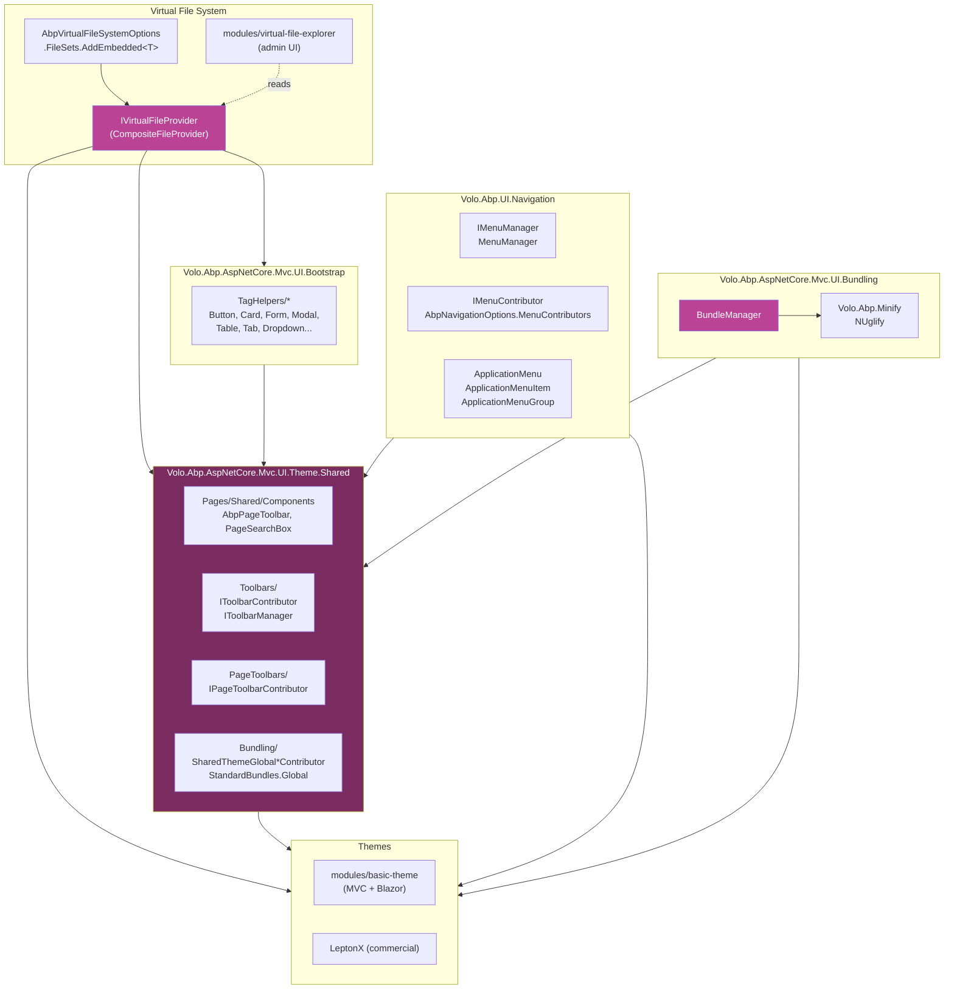

ABP's web UI for ASP.NET Core MVC / Razor Pages is composed of a small set of layered packages. The lowest layer is the **virtual file system** — every package ships its `.cshtml`, `.css`, `.js`, images, and static libs as **embedded resources** and registers them with `AbpVirtualFileSystemOptions.FileSets`. On top of that the **Bootstrap** package exposes Bootstrap 5 as a rich library of ABP tag helpers (`<abp-button>`, `<abp-card>`, `<abp-input>`…). The **Theme.Shared** package collects layout components, page toolbars, the global error page, and the shared bundle contributors that every theme inherits. A concrete theme — the open-source [**Basic theme**](/modules/basic-theme/overview) module, or the commercial **LeptonX** theme — plugs into `AbpThemingOptions`, declares its layouts and bundles, and contributes a top toolbar. Cross-cutting, the **UI.Navigation** package gives you `IMenuContributor` / `IMenuManager` for the main menu and `IToolbarContributor` / `IToolbarManager` for the header toolbars. Finally, **Bundling** wires `BundleManager` to `IJavascriptMinifier` / `ICssMinifier` (NUglify) so that ABP modules can declare CSS/JS contributors instead of static `<script>` tags.

This group documents every one of those packages from the source tree under [`framework/src/`](https://github.com/abpframework/abp/tree/dev/framework/src) and [`modules/basic-theme/src/`](https://github.com/abpframework/abp/tree/dev/modules/basic-theme/src). If you are looking for **how to use** these features in your application (CLI commands, NuGet packages, install snippets), see the companion pages under `/aspnetcore/` and `/modules/`.

## How the pieces fit



Everything above is concrete code in the repo:

- `AbpAspNetCoreMvcUiThemeSharedModule` depends on `AbpAspNetCoreMvcUiBootstrapModule`, `AbpAspNetCoreMvcUiPackagesModule`, and `AbpAspNetCoreMvcUiWidgetsModule` — every shared theme has Bootstrap.
- `AbpAspNetCoreMvcUiBasicThemeModule` depends on `AbpAspNetCoreMvcUiThemeSharedModule` and registers a `BasicTheme : ITheme` plus `BasicThemeBundles.Styles.Global` / `Scripts.Global` that **`AddBaseBundles(StandardBundles.Styles.Global)`** — i.e. they inherit the shared global bundle.
- `BundleManager` resolves contributors, runs them through `IScriptBundler` / `IStyleBundler`, and only minifies when `AbpBundlingOptions.Mode` is `BundleAndMinify` or `Auto` outside `IsDevelopment()`.

## Layers, top to bottom

A request to a Razor Page in an ABP MVC application traverses the following stack. Each layer is documented in its own page below.

1. **Bootstrap tag helpers** — the page itself is written in `<abp-card>` / `<abp-input>` / `<abp-table>` markup. The tag helper services emit Bootstrap-compatible HTML. No business logic here.
2. **Shared theme infrastructure** — the layout the page renders into is composed of view components shipped by `Theme.Shared`: `AbpPageToolbar`, `AbpPageSearchBox`, the header toolbar, the brand placeholder, the menu component. The package also seeds the `Global` style/script bundle.
3. **A concrete theme** — `BasicTheme` (or `LeptonXTheme`) implements `ITheme.GetLayout(string)`. The shared theme uses the result to render the page in `~/Themes/<Name>/Layouts/Application.cshtml`.
4. **Navigation** — `IMenuManager.GetMainMenuAsync()` produces the `ApplicationMenu` rendered by the menu view component. `IToolbarManager.GetAsync(StandardToolbars.Main)` produces the header toolbar items.
5. **Bundling** — `<abp-style-bundle name="Basic.Global" />` and `<abp-script-bundle name="Basic.Global" />` resolve to one bundled file or a list of `<link>` / `<script>` tags depending on `AbpBundlingOptions.Mode` (see [/aspnetcore/mvc-ui-bundling](/aspnetcore/mvc-ui-bundling)).
6. **Minification** — when bundling is enabled, the bundlers route the concatenated content through `IJavascriptMinifier` / `ICssMinifier` (NUglify by default).
7. **Virtual file system** — every `.cshtml`, every `.css`, every JS file the layers above reference is served by the composite `IVirtualFileProvider`. Modules contribute embedded resources through `AbpVirtualFileSystemOptions.FileSets.AddEmbedded<T>(...)` and a developer can replace any of them with a `PhysicalFileProvider` for hot iteration.

## Pages in this group

<CardGroup cols={2}>
  <Card title="Theme.Shared" icon="layer-group" href="/ui/theme-shared">
    `Volo.Abp.AspNetCore.Mvc.UI.Theme.Shared` and its `.Demo` companion. Shared layout components, page toolbars, the global error page, `IToolbarManager` / `IPageToolbarManager`, and `StandardBundles`.
  </Card>
  <Card title="Bootstrap tag helpers" icon="bootstrap" href="/ui/bootstrap-theme">
    `Volo.Abp.AspNetCore.Mvc.UI.Bootstrap` — Bootstrap 5 distributed as ABP tag helpers and view components (`<abp-button>`, `<abp-card>`, `<abp-input>`, `<abp-modal>`, `<abp-table>`, dropdowns, navs, breadcrumbs, badges, alerts, …).
  </Card>
  <Card title="Basic theme module" icon="paint-roller" href="/ui/basic-theme">
    `modules/basic-theme/` — the open-source MVC + Blazor theme. `BasicTheme`, `BasicThemeBundles`, `BasicThemeMainTopToolbarContributor`, `AbpThemingOptions.Themes.Add<BasicTheme>()`. Different from the commercial LeptonX theme.
  </Card>
  <Card title="Navigation and menus" icon="bars" href="/ui/navigation-and-menus">
    `Volo.Abp.UI.Navigation` — `IMenuManager`, `IMenuContributor`, `ApplicationMenu`, `ApplicationMenuItem`, `ApplicationMenuGroup`, `StandardMenus.Main`, plus `IToolbarManager` / `IToolbarContributor`.
  </Card>
  <Card title="Virtual file system" icon="folder-tree" href="/ui/virtual-file-system">
    `Volo.Abp.VirtualFileSystem` — `IVirtualFileProvider`, `AbpVirtualFileSystemOptions.FileSets`, `EmbeddedVirtualFileSetInfo`, `AddEmbedded<T>()`, `ReplaceEmbeddedByPhysical<T>()`, and the `modules/virtual-file-explorer` admin UI.
  </Card>
  <Card title="Minify and bundling" icon="boxes-stacked" href="/ui/minify-and-bundling">
    `Volo.Abp.Minify` (NUglify-based JS/CSS/HTML minifiers) and `Volo.Abp.AspNetCore.Mvc.UI.Bundling` — `BundleManager`, `<abp-script-bundle>` / `<abp-style-bundle>`, `AbpBundlingOptions.Mode`, global assets.
  </Card>
</CardGroup>

## Reading the source

If you prefer to start in code, here is a guided path that mirrors the diagram. Each step is one or two files; together they form a minimum understanding of the stack.

```csharp
// 1. The shared theme module wires Bootstrap + Packages + Widgets and seeds the Global bundle
[DependsOn(
    typeof(AbpAspNetCoreMvcUiBootstrapModule),
    typeof(AbpAspNetCoreMvcUiPackagesModule),
    typeof(AbpAspNetCoreMvcUiWidgetsModule)
    )]
public class AbpAspNetCoreMvcUiThemeSharedModule : AbpModule
{
    public override void ConfigureServices(ServiceConfigurationContext context)
    {
        Configure<AbpVirtualFileSystemOptions>(options =>
        {
            options.FileSets.AddEmbedded<AbpAspNetCoreMvcUiThemeSharedModule>(
                "Volo.Abp.AspNetCore.Mvc.UI.Theme.Shared");
        });

        Configure<AbpBundlingOptions>(options =>
        {
            options.StyleBundles.Add(StandardBundles.Styles.Global,
                bundle => bundle.AddContributors(typeof(SharedThemeGlobalStyleContributor)));
            options.ScriptBundles.Add(StandardBundles.Scripts.Global,
                bundle => bundle.AddContributors(typeof(SharedThemeGlobalScriptContributor)));
        });
    }
}
```

```csharp
// 2. The Basic theme depends on Theme.Shared and extends the Global bundle
[DependsOn(typeof(AbpAspNetCoreMvcUiThemeSharedModule),
           typeof(AbpAspNetCoreMvcUiMultiTenancyModule))]
public class AbpAspNetCoreMvcUiBasicThemeModule : AbpModule
{
    public override void ConfigureServices(ServiceConfigurationContext context)
    {
        Configure<AbpThemingOptions>(options =>
        {
            options.Themes.Add<BasicTheme>();
            if (options.DefaultThemeName == null)
                options.DefaultThemeName = BasicTheme.Name;
        });

        Configure<AbpBundlingOptions>(options =>
        {
            options.StyleBundles.Add(BasicThemeBundles.Styles.Global, b => b
                .AddBaseBundles(StandardBundles.Styles.Global)            // <-- inherit
                .AddContributors(typeof(BasicThemeGlobalStyleContributor)));

            options.ScriptBundles.Add(BasicThemeBundles.Scripts.Global, b => b
                .AddBaseBundles(StandardBundles.Scripts.Global)
                .AddContributors(typeof(BasicThemeGlobalScriptContributor)));
        });

        Configure<AbpToolbarOptions>(options =>
        {
            options.Contributors.Add(new BasicThemeMainTopToolbarContributor());
        });
    }
}
```

```csharp
// 3. The virtual file provider composes every module's embedded files plus dynamic output
public class VirtualFileProvider : IVirtualFileProvider, ISingletonDependency
{
    protected virtual IFileProvider CreateHybridProvider(IDynamicFileProvider dynamicFileProvider)
    {
        var fileProviders = new List<IFileProvider> { dynamicFileProvider };
        foreach (var fileSet in _options.FileSets.AsEnumerable().Reverse())
            fileProviders.Add(fileSet.FileProvider);
        return new CompositeFileProvider(fileProviders);
    }
}
```

Once you understand those three pieces — and how `BundleManager` reads `AbpBundlingOptions.Mode` to decide between bundle-and-minify versus per-file `<script>` tags — the rest of the UI stack is reading material.

## How a request renders

When the framework starts and a request comes in for a Razor Page:

1. Every module that contributed to `AbpVirtualFileSystemOptions.FileSets` is exposed through a single `IVirtualFileProvider` (a `CompositeFileProvider`). Razor finds `~/Themes/Basic/Layouts/Application.cshtml` here, even though the file is embedded in a NuGet DLL.
2. The page's `Layout` is resolved by `IThemeManager.CurrentTheme.GetLayout(StandardLayouts.Application)`. For `BasicTheme` that returns `~/Themes/Basic/Layouts/Application.cshtml`.
3. The layout's `<abp-script-bundle name="Basic.Global" />` and `<abp-style-bundle name="Basic.Global" />` are resolved by `BundleManager`. The `Basic.Global` bundle `AddBaseBundles(StandardBundles.Styles.Global)`, so the contributors of the shared `Global` bundle run first.
4. The header view component calls `IMenuManager.GetMainMenuAsync()` and `IToolbarManager.GetAsync(StandardToolbars.Main)`. Both walk their contributor lists from `AbpNavigationOptions.MenuContributors` and `AbpToolbarOptions.Contributors`.
5. The page's `<abp-page-toolbar />` tag helper resolves `IPageToolbarManager` against `AbpPageToolbarOptions.Toolbars` keyed by `typeof(TPage).FullName`.

Everything downstream of step 3 is **minified** if `AbpBundlingOptions.Mode == BundleAndMinify`, or in `Auto` mode when `!IWebHostEnvironment.IsDevelopment()`.

## Standard names you will see again

A handful of constants appear in every theme implementation and every contributor. Memorising them makes the rest of the source navigable:

| Constant | Defined in | Value |
| --- | --- | --- |
| `StandardLayouts.Application` | `Volo.Abp.AspNetCore.Mvc.UI.Theming` | `"Application"` — the full chrome layout |
| `StandardLayouts.Account` | same | `"Account"` — the auth-pages layout |
| `StandardLayouts.Empty` | same | `"Empty"` — `<body>@RenderBody()</body>` |
| `StandardMenus.Main` | `Volo.Abp.UI.Navigation` | `"Main"` — the primary application menu |
| `StandardMenus.User` | same | `"User"` — the per-user dropdown menu |
| `StandardMenus.Shortcut` | same | `"Shortcut"` — quick actions area |
| `StandardToolbars.Main` | `Theme.Shared.Toolbars` | `"Main"` — header toolbar key |
| `StandardBundles.Styles.Global` | `Theme.Shared.Bundling` | `"Global"` |
| `StandardBundles.Scripts.Global` | same | `"Global"` |
| `BasicThemeBundles.Styles.Global` | `Theme.Basic.Bundling` | `"Basic.Global"` |
| `BasicThemeBundles.Scripts.Global` | same | `"Basic.Global"` |
| `DefaultMenuNames.Application.Main.Administration` | `Volo.Abp.UI.Navigation` | `"Abp.Application.Main.Administration"` |
| `BasicTheme.Name` | `Theme.Basic` | `"Basic"` |

## Where to look in the source

Every page in this group is grounded in concrete folders on disk. As a quick index:

| Concept | Folder |
| --- | --- |
| Theme contract (`ITheme`, `IThemeManager`, `StandardLayouts`) | `framework/src/Volo.Abp.AspNetCore.Mvc.UI.Theming/` |
| Shared layout building blocks (page toolbar, page search, error) | `framework/src/Volo.Abp.AspNetCore.Mvc.UI.Theme.Shared/` |
| Bootstrap tag helpers (`<abp-button>`, `<abp-card>`, …) | `framework/src/Volo.Abp.AspNetCore.Mvc.UI.Bootstrap/TagHelpers/` |
| Menu model and `IMenuManager` | `framework/src/Volo.Abp.UI.Navigation/Volo/Abp/Ui/Navigation/` |
| Header toolbar pipeline (`IToolbarManager`) | `framework/src/Volo.Abp.AspNetCore.Mvc.UI.Theme.Shared/Toolbars/` |
| Per-page toolbar pipeline (`IPageToolbarManager`) | `framework/src/Volo.Abp.AspNetCore.Mvc.UI.Theme.Shared/PageToolbars/` |
| Virtual file system runtime | `framework/src/Volo.Abp.VirtualFileSystem/Volo/Abp/VirtualFileSystem/` |
| `BundleManager`, `IScriptBundler`, `IStyleBundler` | `framework/src/Volo.Abp.AspNetCore.Mvc.UI.Bundling/` |
| Minification (NUglify-based JS/CSS/HTML) | `framework/src/Volo.Abp.Minify/` |
| Basic theme — MVC + Razor Pages | `modules/basic-theme/src/Volo.Abp.AspNetCore.Mvc.UI.Theme.Basic/` |
| Basic theme — Blazor (Server / WebAssembly) | `modules/basic-theme/src/Volo.Abp.AspNetCore.Components.*.BasicTheme/` |
| Virtual file explorer admin UI | `modules/virtual-file-explorer/src/Volo.Abp.VirtualFileExplorer.Web/` |

## End-to-end: adding a feature to the UI

A worked example to anchor the abstractions. Suppose you are adding a "Books" admin section to an MVC application running the Basic theme:

1. **Define a menu item.** Implement `IMenuContributor` and add it to `AbpNavigationOptions.MenuContributors`. The contributor calls `context.Menu.AddItem(new ApplicationMenuItem("BookStore.Books", l["Menu:Books"], "/Books"))`. The menu manager runs your contributor on the next request, evaluates `RequirePermissions(...)`, and the menu view component renders the result inside the Basic theme's side navigation. See [/ui/navigation-and-menus](/ui/navigation-and-menus).
2. **Write the Razor Page.** Drop `Pages/Books/Index.cshtml(.cs)` into your module. You usually do not have to set `Layout` at all — `Theme.Shared` ships a `Pages/_ViewStart.cshtml` that runs `Layout = ThemeManager.CurrentTheme.GetApplicationLayout();`, which calls `ITheme.GetLayout(StandardLayouts.Application)`. For `BasicTheme` that resolves to `~/Themes/Basic/Layouts/Application.cshtml` (see [/ui/basic-theme](/ui/basic-theme)). If you need a different one, set `Layout = StandardLayouts.Account;` (or `Empty`).
3. **Compose the page UI** with Bootstrap tag helpers: `<abp-card>`, `<abp-table>`, `<abp-button>`, `<abp-modal>` — entirely server-rendered, no extra JS framework. See [/ui/bootstrap-theme](/ui/bootstrap-theme).
4. **Add a page toolbar.** Configure `AbpPageToolbarOptions.Configure<IndexModel>(t => t.AddButton(...))` to add a "New book" button at the top of the page. The button is rendered by `AbpPageToolbarViewComponent` (see [/ui/theme-shared](/ui/theme-shared)).
5. **Ship the static assets.** Put your `Pages/Books/index.css` and `Pages/Books/index.js` next to the Razor file and embed them through `AbpVirtualFileSystemOptions.FileSets.AddEmbedded<MyModule>(...)`. Register them in a `BundleContributor` and add the bundle to your layout — or, more commonly, append your contributor to the existing `BasicThemeBundles.Scripts.Global` bundle via `AbpBundleContributorOptions.Extensions<...>().Add<...>()`. See [/ui/virtual-file-system](/ui/virtual-file-system) and [/ui/minify-and-bundling](/ui/minify-and-bundling).
6. **Iterate.** In `Development`, `AbpBundlingOptions.Mode = Auto` falls back to per-file `<script>` tags; in `Production`, the same bundle is concatenated and minified through NUglify.

Nothing in steps 1–6 is theme-specific. Swap `BasicTheme` for the LeptonX commercial theme by changing only your application module's `[DependsOn]` — every page above continues to work because the standard layout names, the menu contributor pipeline, the page toolbar pipeline, and the bundle names are all part of `Theme.Shared`, not the theme.

## What this group does *not* cover

- **Theme contract** (`ITheme`, `IThemeManager`, `AbpThemingOptions.Themes.Add<T>()`, `StandardLayouts.Application/Account/Empty`). These live in `Volo.Abp.AspNetCore.Mvc.UI.Theming/` and are referenced from every theme page below; if you want the contract itself, jump to the theming primitives page in the ASP.NET Core MVC group.
- **The widgets system** (`Volo.Abp.AspNetCore.Mvc.UI.Widgets`). The shared theme depends on it, but widget *definitions* (`WidgetDefinition`, `IWidgetManager`) belong in the dashboard / CMS Kit docs.
- **LeptonX commercial theme**. The Basic theme page below points out where LeptonX diverges; for the LeptonX-specific layouts, bundles, and configuration switches see the commercial theme documentation.
- **The Angular and MAUI Blazor UI stacks**. Those reuse `Volo.Abp.UI.Navigation` (the menu model is UI-agnostic) but have different bundling and theme contracts. See the dedicated Angular / MAUI sections.

## Conventions to keep in mind

A few patterns are repeated everywhere across the UI stack. They are easy to miss the first time and obvious once pointed out.

- **Options-first configuration.** Every extension point is an options class (`AbpThemingOptions`, `AbpNavigationOptions`, `AbpToolbarOptions`, `AbpPageToolbarOptions`, `AbpBundlingOptions`, `AbpBundleContributorOptions`, `AbpVirtualFileSystemOptions`, `AbpErrorPageOptions`). Modules contribute by calling `Configure<...>(...)` in `ConfigureServices`. There are no extension methods that hide a global static — every customization is local to a module's `IServiceCollection` configuration.
- **Contributor lists, not one-off callbacks.** Menus, toolbars, page toolbars, and bundles are all assembled from typed *contributor* objects (`IMenuContributor`, `IToolbarContributor`, `IPageToolbarContributor`, `BundleContributor`). Each module adds its contributors at startup; the manager iterates them at render time. The contract is async, so a contributor can hit the database or call an HTTP API if it has to.


- **Tag helpers split into POCO + service.** Every `<abp-*>` is implemented as a thin `TagHelper` class and a companion `*TagHelperService` that does the work. The split makes it possible to inject DI services (localizer, view-component renderer, model binder) without exposing them on the tag-helper signature. When subclassing, you almost always override the service, not the helper.
- **`AddBaseBundles(...)` inheritance for bundles.** A theme's `Basic.Global` bundle calls `AddBaseBundles(StandardBundles.Styles.Global)` so it transparently picks up every contributor the shared theme registered. Application modules use the same pattern to extend their theme's bundle without redefining it.
- **`if (context.Theme is BasicTheme)` guards in contributors.** Toolbar and menu contributors live in a single global list and can run for any theme. The first guard in every theme-specific contributor checks the active theme and short-circuits if it does not match, so the same contributor coexists safely with future themes (LeptonX, custom).
- **Embedded resources + virtual paths.** Every Razor file you see in `~/Themes/...` or `~/Pages/...` inside the framework source ends up as an *embedded resource* in the compiled DLL and is served by the composite virtual file provider — there is no copy of the file under your `bin/` or `wwwroot/`. To override one, ship a file at the same virtual path from a later-registered file set; you do not have to fork the producing module.
- **State checkers, not direct `if (User.IsInRole(...))`.** Menu items and toolbar items declare requirements through the `IHasSimpleStateCheckers<T>` API (`RequirePermissions(...)`, `RequireFeatures(...)`, `RequireGlobalFeatures(...)`). The manager evaluates them in batch and removes blocked items from the result. Never filter your own contributor based on the current user — let the pipeline do it so caching and batching work.
- **`AddApplicationPartIfNotExists(...)` in `PreConfigureServices`.** Every UI-shipping module (Theme.Shared, every theme, every admin module) registers its own assembly as an MVC application part. Without this, the embedded Razor views and view components would not be discoverable by the view engine, even though they are present in the virtual file system. Copy the pattern when you ship Razor content from your own library.
- **Permission names are strings, but constants are conventional.** Every contributor that calls `.RequirePermissions("MyModule.Books.Default")` accepts a raw string, but every module also defines a `*Permissions` static class with `public const string` entries that the contributor references — so renames are caught by the compiler instead of at runtime.
- **`Default.cshtml` is the convention.** Every view component lives in a folder named after its prefix (`AbpPageToolbar/`, `AbpPageSearchBox/`, `MainNavbar/`, …) with a `Default.cshtml` Razor template. The `*.cs` class explicitly references that path: `return View("~/Pages/Shared/Components/AbpPageToolbar/Default.cshtml", model);`. The convention makes overrides trivial — drop your replacement at the same path from a later-registered file set.

## Theming a host versus building a theme

Two distinct activities use everything documented in this group:

- **Theming a host application** — you reference an existing theme NuGet (Basic or LeptonX), add a `MenuContributor`, contribute styles/scripts to the theme's `Global` bundle, override a handful of view component `Default.cshtml` files at the same virtual path, and ship. Most ABP applications live here.
- **Building a new theme** — you implement `ITheme.GetLayout(string)`, ship `~/Themes/<Name>/Layouts/{Application,Account,Empty}.cshtml`, register your theme with `AbpThemingOptions.Themes.Add<T>()`, configure your theme's bundles to `AddBaseBundles(StandardBundles.*.Global)`, and contribute a `IToolbarContributor` for the header. The `modules/basic-theme/` source is the reference implementation.

## Suggested reading order

If you are new to the ABP UI stack, the seven pages below are written so they can be read in order. They cite real file paths and quote actual C# from the framework source, so they are also a useful reference even if you have shipped ABP applications before.

A shorter path that gets you productive faster:

1. **[/ui/virtual-file-system](/ui/virtual-file-system)** — the foundation. Understand how a Razor file ends up at `~/Themes/Basic/Layouts/Application.cshtml` before reading anything about themes.
2. **[/ui/bootstrap-theme](/ui/bootstrap-theme)** — the tag helpers every layout and every admin page is composed of.
3. **[/ui/theme-shared](/ui/theme-shared)** — the page toolbar pipeline and the standard `Global` bundle.
4. **[/ui/basic-theme](/ui/basic-theme)** — how a concrete theme assembles the layers above.
5. **[/ui/navigation-and-menus](/ui/navigation-and-menus)** — the menu and toolbar pipelines.
6. **[/ui/minify-and-bundling](/ui/minify-and-bundling)** — the production-mode bundling and NUglify pipeline.

After those, the ASP.NET Core MVC pages ([/aspnetcore/mvc-ui-bundling](/aspnetcore/mvc-ui-bundling), [/aspnetcore/mvc-ui-packages](/aspnetcore/mvc-ui-packages)) cover the higher-level CLI commands, NuGet packages, and `libs/` installation that you only touch from your application's host project. The Blazor counterpart, including the Server / WebAssembly hosts of the Basic theme, lives at [/blazor/theming](/blazor/theming). Installation, CLI, and packaging specifics for the Basic theme module are at [/modules/basic-theme/overview](/modules/basic-theme/overview).

## Related references

- ASP.NET Core surface: [/aspnetcore/mvc-ui-bundling](/aspnetcore/mvc-ui-bundling) and [/aspnetcore/mvc-ui-packages](/aspnetcore/mvc-ui-packages).
- Blazor side: [/blazor/theming](/blazor/theming) — the Blazor host of the Basic theme lives under `modules/basic-theme/src/Volo.Abp.AspNetCore.Components.*.BasicTheme/`.
- Module installation, CLI, and `abp install-libs`: [/modules/basic-theme/overview](/modules/basic-theme/overview).
