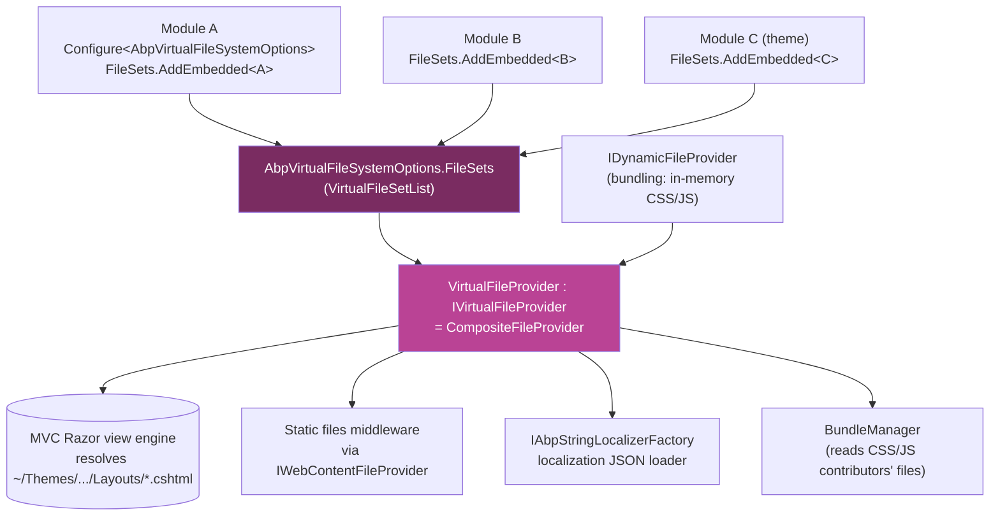

ABP modules are distributed as **single NuGet packages** that contain Razor views, JavaScript, CSS, images, localization JSON, and other static files **embedded** in the assembly. The host application has no copy of these files in `wwwroot` or `Pages/` — they are served at runtime from inside the DLL through ABP's **virtual file system**.

The virtual file system is a thin layer on top of `Microsoft.Extensions.FileProviders`:

- Each module registers its embedded resources as a `VirtualFileSetInfo` in `AbpVirtualFileSystemOptions.FileSets`.
- At runtime the framework composes them all into one `IVirtualFileProvider` (a `CompositeFileProvider`).
- The MVC view engine, the static-files middleware, the bundling pipeline, and the localization JSON loader all read from this provider.
- A developer can replace any embedded file set with a **physical** folder on disk (`ReplaceEmbeddedByPhysical<T>(...)`) for fast iteration without rebuilding the dependent module.

This page documents the runtime that makes that work and the optional `Volo.Abp.VirtualFileExplorer` admin UI you can drop into your app to browse every registered file.

## Source layout

```
framework/src/Volo.Abp.VirtualFileSystem/Volo/Abp/VirtualFileSystem/
├── AbpVirtualFileSystemModule.cs
├── AbpVirtualFileSystemOptions.cs        # public FileSets : VirtualFileSetList
├── IVirtualFileProvider.cs               # : IFileProvider (marker)
├── VirtualFileProvider.cs                # ISingletonDependency, CompositeFileProvider
├── VirtualFileSetInfo.cs                 # base, wraps IFileProvider
├── VirtualFileSetList.cs                 # List<VirtualFileSetInfo>
├── VirtualFileSetListExtensions.cs       # AddEmbedded<T>, AddPhysical, ReplaceEmbeddedByPhysical<T>
├── IDynamicFileProvider.cs               # for in-memory generated files (bundling)
├── DynamicFileProvider.cs
├── DictionaryBasedFileProvider.cs
├── InMemoryFileInfo.cs
├── VirtualDirectoryFileInfo.cs
├── EnumerableDirectoryContents.cs
├── VirtualFilePathHelper.cs
├── Embedded/
│   ├── AbpEmbeddedFileProvider.cs        # reads ManifestResourceNames
│   ├── EmbeddedResourceFileInfo.cs
│   └── EmbeddedVirtualFileSetInfo.cs
└── Physical/
    └── PhysicalVirtualFileSetInfo.cs

modules/virtual-file-explorer/src/
├── Volo.Abp.VirtualFileExplorer.Contracts/
└── Volo.Abp.VirtualFileExplorer.Web/     # MVC admin UI under /VirtualFileExplorer
```

## How it composes



The composition order matters: `VirtualFileProvider` iterates `_options.FileSets` **in reverse**, so the **last-registered file set wins** when two modules expose the same path. This is exactly how a theme overrides a shared partial — it registers later and ships a file at the same `~/Themes/Basic/Components/Brand/Default.cshtml` path. The dynamic file provider is queried first, ahead of every file set, so the bundling output of `BundleManager` (`/wwwroot/global-bundle.css`, etc.) wins over any disk file.

## The options

```csharp
// AbpVirtualFileSystemOptions.cs
public class AbpVirtualFileSystemOptions
{
    public VirtualFileSetList FileSets { get; }

    public AbpVirtualFileSystemOptions()
    {
        FileSets = new VirtualFileSetList();
    }
}

// VirtualFileSetList.cs
public class VirtualFileSetList : List<VirtualFileSetInfo> { }

// VirtualFileSetInfo.cs
public class VirtualFileSetInfo
{
    public IFileProvider FileProvider { get; }
    public VirtualFileSetInfo(IFileProvider fileProvider) { ... }
}
```

`EmbeddedVirtualFileSetInfo` adds an `Assembly` and an optional `BaseFolder`:

```csharp
// Embedded/EmbeddedVirtualFileSetInfo.cs
public class EmbeddedVirtualFileSetInfo : VirtualFileSetInfo
{
    public Assembly Assembly  { get; }
    public string?  BaseFolder { get; }

    public EmbeddedVirtualFileSetInfo(IFileProvider fileProvider,
                                      Assembly assembly,
                                      string? baseFolder = null) : base(fileProvider) { ... }
}
```

## The extension methods you actually call

`VirtualFileSetListExtensions` is the surface every module uses:

```csharp
public static class VirtualFileSetListExtensions
{
    public static void AddEmbedded<T>(this VirtualFileSetList list,
                                      string? baseNamespace = null,
                                      string? baseFolder = null)
    {
        var assembly = typeof(T).Assembly;
        var fileProvider = CreateFileProvider(assembly, baseNamespace, baseFolder);
        list.Add(new EmbeddedVirtualFileSetInfo(fileProvider, assembly, baseFolder));
    }

    public static void AddPhysical(this VirtualFileSetList list,
                                   string root,
                                   ExclusionFilters exclusionFilters = ExclusionFilters.Sensitive)
    {
        var fileProvider = new PhysicalFileProvider(root, exclusionFilters);
        list.Add(new PhysicalVirtualFileSetInfo(fileProvider, root));
    }

    private static IFileProvider CreateFileProvider(Assembly assembly,
                                                    string? baseNamespace = null,
                                                    string? baseFolder = null)
    {
        var info = assembly.GetManifestResourceInfo(
            "Microsoft.Extensions.FileProviders.Embedded.Manifest.xml");

        if (info == null)
            return new AbpEmbeddedFileProvider(assembly, baseNamespace);

        return baseFolder == null
            ? new ManifestEmbeddedFileProvider(assembly)
            : new ManifestEmbeddedFileProvider(assembly, baseFolder);
    }

    public static void ReplaceEmbeddedByPhysical<T>(this VirtualFileSetList fileSets,
                                                    string physicalPath) { ... }
}
```

A few things worth understanding:

- If the assembly was compiled with `<GenerateEmbeddedFilesManifest>true</GenerateEmbeddedFilesManifest>` (the standard ABP modules' `csproj` setting), `CreateFileProvider` uses Microsoft's `ManifestEmbeddedFileProvider`. Otherwise it falls back to ABP's own `AbpEmbeddedFileProvider`, which enumerates `Assembly.GetManifestResourceNames()` and converts each `Some.Namespace.path.file.css` resource name back into the `/path/file.css` virtual path.
- `baseNamespace` is the resource-name prefix to strip when materializing paths. Most modules pass the assembly's root namespace explicitly:

```csharp
options.FileSets.AddEmbedded<AbpAspNetCoreMvcUiBootstrapModule>(
    "Volo.Abp.AspNetCore.Mvc.UI.Bootstrap");
```

That tells the provider: every embedded resource whose name starts with `Volo.Abp.AspNetCore.Mvc.UI.Bootstrap` is part of this file set, and its virtual path is whatever follows that prefix.

## The default `IVirtualFileProvider`

```csharp
public interface IVirtualFileProvider : IFileProvider { }

public class VirtualFileProvider : IVirtualFileProvider, ISingletonDependency
{
    private readonly IFileProvider _hybridFileProvider;

    public VirtualFileProvider(IOptions<AbpVirtualFileSystemOptions> options,
                               IDynamicFileProvider dynamicFileProvider)
    {
        _options = options.Value;
        _hybridFileProvider = CreateHybridProvider(dynamicFileProvider);
    }

    public IFileInfo        GetFileInfo(string subpath)        => _hybridFileProvider.GetFileInfo(subpath);
    public IDirectoryContents GetDirectoryContents(string sub) => _hybridFileProvider.GetDirectoryContents(sub == "" ? "/" : sub);
    public IChangeToken     Watch(string filter)               => _hybridFileProvider.Watch(filter);

    protected virtual IFileProvider CreateHybridProvider(IDynamicFileProvider dynamicFileProvider)
    {
        var fileProviders = new List<IFileProvider> { dynamicFileProvider };

        foreach (var fileSet in _options.FileSets.AsEnumerable().Reverse())
            fileProviders.Add(fileSet.FileProvider);

        return new CompositeFileProvider(fileProviders);
    }
}
```

The whole runtime is forty lines. The hybrid provider is one `CompositeFileProvider`; everything else is just configuration.

## Registering files from a module

Every ABP module that ships static content (Razor views, JS, CSS, JSON localization) does the same thing:

```csharp
public override void ConfigureServices(ServiceConfigurationContext context)
{
    Configure<AbpVirtualFileSystemOptions>(options =>
    {
        options.FileSets.AddEmbedded<MyModule>("MyCompany.MyApp.Web");
    });
}
```

The MSBuild side of the same module turns its `Pages/`, `Views/`, `wwwroot/`, and localization JSON into embedded resources. Most templates use:

```xml
<ItemGroup>
  <Content Remove="Pages\**\*.cshtml;Views\**\*.cshtml;wwwroot\**\*" />
  <EmbeddedResource Include="Pages\**\*.cshtml;Views\**\*.cshtml;wwwroot\**\*" />
</ItemGroup>
```

(The exact pattern is generated by the ABP solution templates and the `abp install-libs` tool; see [/aspnetcore/mvc-ui-packages](/aspnetcore/mvc-ui-packages).)

## Replacing an embedded file set with a physical folder

When you are developing a UI fix in one module that is consumed as NuGet by another, you can point the consuming app at the producer's source folder so edits become hot-reloadable:

```csharp
// In your *application* module
public override void PreConfigureServices(ServiceConfigurationContext context)
{
    if (_hostEnvironment.IsDevelopment())
    {
        Configure<AbpVirtualFileSystemOptions>(options =>
        {
            options.FileSets.ReplaceEmbeddedByPhysical<MyCompany.SharedUi.SharedUiModule>(
                Path.Combine(_hostEnvironment.ContentRootPath,
                             "..", "..", "..", "shared", "MyCompany.SharedUi"));
        });
    }
}
```

Internals:

```csharp
public static void ReplaceEmbeddedByPhysical<T>(this VirtualFileSetList fileSets, string physicalPath)
{
    var assembly = typeof(T).Assembly;

    for (var i = 0; i < fileSets.Count; i++)
    {
        if (fileSets[i] is EmbeddedVirtualFileSetInfo embedded && embedded.Assembly == assembly)
        {
            var thisPath = embedded.BaseFolder.IsNullOrEmpty()
                ? physicalPath
                : Path.Combine(physicalPath, embedded.BaseFolder!);

            fileSets[i] = new PhysicalVirtualFileSetInfo(
                new PhysicalFileProvider(thisPath), thisPath);
        }
    }
}
```

It finds the `EmbeddedVirtualFileSetInfo` whose assembly matches `T` and swaps it out for a `PhysicalFileProvider` rooted at your source path. Edits to `.cshtml` / `.css` / `.js` are picked up on next request.

## `[Dependency]` and other ABP attributes

The `[Dependency]` attribute defined in `Volo.Abp.DependencyInjection` is unrelated to the file system but worth flagging here because module file-system contributors are often singletons or transients. The attribute lives at:

```csharp
public class DependencyAttribute : Attribute
{
    public virtual ServiceLifetime? Lifetime { get; set; }
    public virtual bool TryRegister { get; set; }
    public virtual bool ReplaceServices { get; set; }

    public DependencyAttribute() { }
    public DependencyAttribute(ServiceLifetime lifetime) { Lifetime = lifetime; }
}
```

In practice you rarely write this attribute yourself when working with the virtual file system — `VirtualFileProvider` is registered as `ISingletonDependency` and you only ever interact with the options.

## The Virtual File Explorer admin UI

`modules/virtual-file-explorer/` ships a self-contained admin module that exposes the runtime `IVirtualFileProvider` as a browsable list under `/VirtualFileExplorer` in your MVC host. It is built like every other ABP admin module — a Contracts package with permissions and localization, and a Web package with Razor Pages.

```csharp
[DependsOn(typeof(AbpAspNetCoreMvcUiBootstrapModule))]
[DependsOn(typeof(AbpAspNetCoreMvcUiThemeSharedModule))]
[DependsOn(typeof(AbpVirtualFileExplorerContractsModule))]
public class AbpVirtualFileExplorerWebModule : AbpModule
{
    public override void ConfigureServices(ServiceConfigurationContext context)
    {
        var virtualFileExplorerOptions =
            context.Services.ExecutePreConfiguredActions<AbpVirtualFileExplorerOptions>();

        if (virtualFileExplorerOptions.IsEnabled)
        {
            Configure<AbpNavigationOptions>(options =>
            {
                options.MenuContributors.Add(new VirtualFileExplorerMenuContributor());
            });

            Configure<AbpVirtualFileSystemOptions>(options =>
            {
                options.FileSets.AddEmbedded<AbpVirtualFileExplorerWebModule>(
                    "Volo.Abp.VirtualFileExplorer.Web");
            });
        }
    }
}
```

The page itself is straightforward — it injects `IVirtualFileProvider`, walks `GetDirectoryContents(Path)`, paginates the result, and renders it with a `<abp-table>`:

```csharp
[Authorize(VirtualFileExplorerPermissions.View)]
public class IndexModel : VirtualFileExplorerPageModel
{
    [BindProperty(SupportsGet = true)] public string Path        { get; set; } = "/";
    [BindProperty(SupportsGet = true)] public int    CurrentPage { get; set; } = 1;
    [BindProperty(SupportsGet = true)] public int    PageSize    { get; set; } = 10;

    public List<FileInfoViewModel> FileInfoList { get; set; }
    public PagerModel              PagerModel   { get; set; }
}
```

A `FileContentModal` page reads the bytes through `IVirtualFileProvider.GetFileInfo(...)` and shows the content in a modal with PrismJS syntax highlighting — note the `PrismjsStyleBundleContributorDocsExtension` registration in the module above.

Enable the explorer in your app by depending on `AbpVirtualFileExplorerWebModule`, granting the `VirtualFileExplorerPermissions.View` permission to your administrator role, and opening `/VirtualFileExplorer`.

## Cross-references

- The bundling pipeline that consumes virtual files (and feeds the dynamic file provider): [/ui/minify-and-bundling](/ui/minify-and-bundling), [/aspnetcore/mvc-ui-bundling](/aspnetcore/mvc-ui-bundling).
- The shared theme that adds its own embedded layouts and view components: [/ui/theme-shared](/ui/theme-shared).
- The Basic theme registers `~/Themes/Basic/Layouts/Application.cshtml` and friends through this exact mechanism: [/ui/basic-theme](/ui/basic-theme), [/modules/basic-theme/overview](/modules/basic-theme/overview).
- The Bootstrap tag helpers ship their Razor partials through the same registration: [/ui/bootstrap-theme](/ui/bootstrap-theme).
- `IMenuContributor` (used by `VirtualFileExplorerMenuContributor`): [/ui/navigation-and-menus](/ui/navigation-and-menus).
- The Blazor side and how its component CSS/JS are bundled: [/blazor/theming](/blazor/theming).
