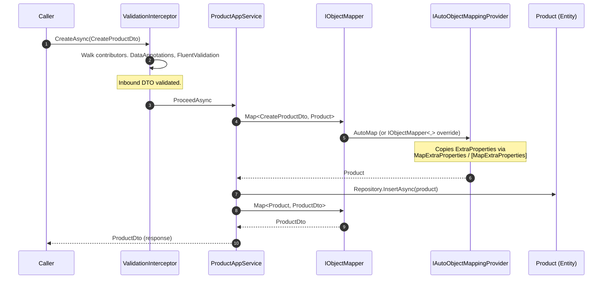

This page is a **recap** focused on the validation/mapping interaction. For the full `IObjectMapper` API, `IMapTo`/`IMapFrom`, `DefaultObjectMapper`, and provider-resolution details, read the dedicated [Object Mapping](/ddd/object-mapping) page first. Here we look at object mapping from the *validation* angle: what is validated, what is mapped, in what order, and what happens to extra properties.

## The 30-second model

```
HTTP request ──► [ValidationInterceptor] ──► AppService method body
                                                  │
                                                  ├─► IObjectMapper.Map<CreateDto, Entity>
                                                  ├─► Repository.InsertAsync(entity)
                                                  └─► return IObjectMapper.Map<Entity, Dto>(entity)
                                                                                              │
                                                                                              ▼
                                                                                       HTTP response
```

- The **interceptor** runs the validation pipeline against the *inbound* DTO. By the time the method body executes, the DTO is known to be structurally valid.
- The **application service body** maps the DTO to an entity (and, on the way out, an entity back to a DTO). No re-validation happens — mapping is a value transformation, not a trust boundary.
- If the mapping produces an invalid entity (e.g. via a manual `IObjectMapper<,>` that does not normalise a string), the framework will not catch it. The domain model itself should guard those invariants.

## Folder map (recap)

```
framework/src/Volo.Abp.ObjectMapping/Volo/Abp/ObjectMapping/
├── AbpObjectMappingModule.cs
├── DefaultObjectMapper.cs
├── IAutoObjectMappingProvider.cs
├── IMapFrom.cs
├── IMapTo.cs
├── IObjectMapper.cs
├── NotImplementedAutoObjectMappingProvider.cs
├── ObjectMapperExtensions.cs
└── ObjectMappingHelper.cs
```

See [`/ddd/object-mapping`](/ddd/object-mapping) for the full breakdown. The pieces that matter for the validation pipeline are:

| Symbol | Why it matters for validation |
| --- | --- |
| `IObjectMapper` | The seam app services use. Called *after* validation. |
| `IAutoObjectMappingProvider` | The seam pluggable engines (AutoMapper, Mapperly) implement. Determines how extra properties survive mapping. |
| `IMapTo<TDestination>` / `IMapFrom<TSource>` | Manual escape hatches. Run *inside* `DefaultObjectMapper`, *after* validation, *before* the auto-provider. |
| `IObjectMapper<TSource, TDestination>` | Even higher-priority manual mapper. Resolved per call by `DefaultObjectMapper`. |

## IObjectMapper

```csharp
// framework/src/Volo.Abp.ObjectMapping/Volo/Abp/ObjectMapping/IObjectMapper.cs
public interface IObjectMapper
{
    IAutoObjectMappingProvider AutoObjectMappingProvider { get; }

    TDestination Map<TSource, TDestination>(TSource source);
    TDestination Map<TSource, TDestination>(TSource source, TDestination destination);
}
```

`ApplicationService` exposes `ObjectMapper` as a lazy-resolved property. The typical usage:

```csharp
public class ProductAppService : ApplicationService, IProductAppService
{
    private readonly IRepository<Product, Guid> _repo;

    public ProductAppService(IRepository<Product, Guid> repo) => _repo = repo;

    public async Task<ProductDto> CreateAsync(CreateProductDto input)
    {
        // input is already validated by ValidationInterceptor.
        var product = ObjectMapper.Map<CreateProductDto, Product>(input);
        await _repo.InsertAsync(product);
        return ObjectMapper.Map<Product, ProductDto>(product);
    }
}
```

The `input` parameter has already been walked by every `IObjectValidationContributor` before the body executes. The mapping calls on lines 3 and 5 cannot fail the validation pipeline — they can throw mapping-specific exceptions (covered on [/ddd/object-mapping](/ddd/object-mapping)) but those are not `AbpValidationException`.

## DefaultObjectMapper resolution order

`DefaultObjectMapper.Map<TSource, TDestination>(source)` tries, in order:

1. `IObjectMapper<TSource, TDestination>` from DI. Manual override.
2. Collection mapping (if `TSource`/`TDestination` are both compatible collection types).
3. `source is IMapTo<TDestination>` — call `mapperSource.MapTo()`.
4. `IMapFrom<TSource>.IsAssignableFrom(typeof(TDestination))` — try `Activator.CreateInstance(typeof(TDestination), source)`.
5. Fall through to `AutoObjectMappingProvider.Map<TSource, TDestination>(source)`.

```csharp
// framework/src/Volo.Abp.ObjectMapping/Volo/Abp/ObjectMapping/DefaultObjectMapper.cs (excerpt)
public virtual TDestination Map<TSource, TDestination>(TSource source)
{
    if (source == null) return default!;

    using (var scope = ServiceProvider.CreateScope())
    {
        var specificMapper = scope.ServiceProvider.GetService<IObjectMapper<TSource, TDestination>>();
        if (specificMapper != null)
        {
            return specificMapper.Map(source);
        }

        if (TryToMapCollection<TSource, TDestination>(scope, source, default, out var collectionResult))
        {
            return collectionResult;
        }
    }

    if (source is IMapTo<TDestination> mapperSource)
    {
        return mapperSource.MapTo();
    }

    if (typeof(IMapFrom<TSource>).IsAssignableFrom(typeof(TDestination)))
    {
        try
        {
            return (TDestination)Activator.CreateInstance(typeof(TDestination), source)!;
        }
        catch { }
    }

    return AutoMap<TSource, TDestination>(source);
}
```

From the validation perspective, the relevant fact is that **manual mappers (steps 1, 3, 4) run before the engine kicks in**. If you put normalisation logic in a manual `IObjectMapper<TSource, TDestination>`, it runs *after* validation has already approved the source. You are normalising a value the framework has already accepted — do not use the manual mapper as a second validation pass; if you need to reject input, do it in the validator.

## Extra properties: the post-mapping concern

Both `IExtensibleObject` and `IHasExtraProperties` carry an open-ended `ExtraPropertyDictionary`. ABP makes sure that dictionary survives entity → DTO and DTO → entity round trips:

- **AutoMapper:** `MapExtraProperties<TSource, TDestination>` extension (see [/ddd/automapper](/ddd/automapper) and [AutoMapper integration](/validation/automapper-integration)).
- **Mapperly:** `[MapExtraProperties]` attribute on the mapper class (see [/ddd/mapperly](/ddd/mapperly) and [Mapperly integration](/validation/mapperly-integration)).
- **Manual mappers:** you have to copy them yourself.

The validation pipeline does **not** validate extra properties unless you opt in. They are an open key-value store; you typically validate them at a higher level (the domain service that knows which extra keys are allowed for which tenant).



Two things to note:

- **Extra properties flow both ways.** A custom field on the incoming DTO ends up on the entity; a custom field on the entity ends up on the outgoing DTO.
- **Validation runs only on the inbound DTO.** If your domain logic mutates extra properties before returning, those changes are not re-validated.

## When validation and mapping interact: nested DTOs

`DataAnnotationObjectValidationContributor` walks the inbound DTO recursively (up to depth 8). If a nested object inside the DTO ends up being projected to an entity, the validator already checked the nested structure:

```csharp
public class CreateOrderDto
{
    [Required] public Guid CustomerId { get; set; }
    [Required, MinLength(1)] public List<OrderLineDto> Lines { get; set; } = new();
}

public class OrderLineDto
{
    [Required] public Guid ProductId { get; set; }
    [Range(1, 999)] public int Quantity { get; set; }
}
```

By the time `ObjectMapper.Map<CreateOrderDto, Order>(input)` runs:

- `CreateOrderDto.CustomerId` has been required-checked.
- `CreateOrderDto.Lines` has been length-checked.
- Every `OrderLineDto` in `Lines` has been walked individually because the contributor recurses into `IEnumerable`.

So when the mapper projects each line to an `OrderLine` entity, you are mapping a known-good DTO. The entity constructor can use `Check.NotDefault(...)` for defence-in-depth without worrying about the happy path being noisy.

## Inverse direction: entity → DTO

Outbound mapping (entity → DTO) is **not** validated. The framework assumes:

- Entities are valid by construction (you enforced invariants in the domain layer).
- The DTO type was designed by you — there is no security boundary on the output.

If you need to scrub outbound data (e.g. omit a field for non-admin users), do it in the mapper profile or in the app-service method, not through the validation pipeline.

## Manual mapper that needs validated input

A common pattern: a DTO carries a string that the entity expects in a normalised form. Put the normalisation in the manual mapper:

```csharp
public class CreateBlogDtoToBlogMapper : IObjectMapper<CreateBlogDto, Blog>, ITransientDependency
{
    public Blog Map(CreateBlogDto source)
    {
        // source is already validated by the time we get here:
        // - source.Name is non-null and within length.
        // - source.Slug is non-null and within length.
        // Normalisation is safe to do without re-checking.
        return new Blog(
            name: source.Name.Trim(),
            slug: source.Slug.Trim().ToLowerInvariant());
    }

    public Blog Map(CreateBlogDto source, Blog destination)
    {
        destination.SetName(source.Name.Trim());
        destination.SetSlug(source.Slug.Trim().ToLowerInvariant());
        return destination;
    }
}
```

The conventional registrar in `AbpObjectMappingModule` exposes this class as `IObjectMapper<CreateBlogDto, Blog>` automatically (it walks the implemented `IObjectMapper<,>` interfaces). `DefaultObjectMapper.Map<CreateBlogDto, Blog>` picks it up at resolution step 1, so the AutoMapper/Mapperly engine never sees this pair.

## NotImplementedAutoObjectMappingProvider

If you reference `Volo.Abp.ObjectMapping` but do **not** also pull in AutoMapper or Mapperly, the default `IAutoObjectMappingProvider` registration is `NotImplementedAutoObjectMappingProvider`. It throws `NotImplementedException` if you try to map a type pair that has no manual mapper.

Practically: validation still works fine even without an auto provider — the validation pipeline never calls the mapper. You only run into the `NotImplemented` provider when application-service code tries to map a DTO and there is no manual handler. Pick AutoMapper or Mapperly for any non-trivial app service.

## Picking a provider

<CardGroup cols={2}>
  <Card title="AutoMapper" icon="map" href="/validation/automapper-integration">
    Configuration-time profiles. Mature, expressive, runtime-reflective.
  </Card>
  <Card title="Mapperly" icon="bolt" href="/validation/mapperly-integration">
    Source generator. Compile-time errors, zero reflection, AOT-friendly.
  </Card>
</CardGroup>

Both packages plug into the same `IAutoObjectMappingProvider` seam. You can mix and match — manual `IObjectMapper<,>` for one pair, AutoMapper for another, Mapperly for a third — but typically a module picks one as its default.

## Pitfalls

<AccordionGroup>
  <Accordion title="Mapping ran but validation didn't">
    The validation interceptor only attaches to services that implement `IValidationEnabled`. If you create a `Foo` from raw user input inside a domain service that does *not* implement `IValidationEnabled`, mapping runs without validation. Either implement `IValidationEnabled` on the domain service or call `IObjectValidator.ValidateAsync(input)` explicitly before mapping.
  </Accordion>
  <Accordion title="Validation ran but mapping changed the value">
    If a manual `IObjectMapper<,>` mutates a field after validation, the validation result no longer reflects what the entity will store. Move the mutation to a domain-method on the entity instead — that way the domain enforces its own invariants.
  </Accordion>
  <Accordion title="ExtraProperties were not copied">
    Manual `IObjectMapper<,>` does *not* copy `ExtraProperties` for you. The convenience copy lives in the AutoMapper / Mapperly providers. If you implement a manual mapper between `IHasExtraProperties` types, copy the dictionary yourself or fall back to the auto provider.
  </Accordion>
  <Accordion title="Validating mapped entities directly">
    There is nothing wrong with calling `IObjectValidator.ValidateAsync(entity)` after mapping if your entity carries DataAnnotations or has a registered `IValidator<Entity>`. But it is unusual — the typical invariants on an entity are domain-level, not DataAnnotation-level.
  </Accordion>
</AccordionGroup>

## A worked example: validation + mapping + extra properties

To put everything together, here is an application service that:

1. Accepts a DTO with both DataAnnotations and dynamic extra properties.
2. Has the DTO validated by the interceptor (DataAnnotations) and by a FluentValidation rule (the slug must be unique).
3. Maps the DTO to an entity, copying extra properties.
4. Persists and returns a response DTO.

```csharp
// DTO
public class CreateBlogDto : IHasExtraProperties
{
    [Required, StringLength(120)] public string Name { get; set; } = default!;
    [Required, StringLength(120)] public string Slug { get; set; } = default!;
    public ExtraPropertyDictionary ExtraProperties { get; set; } = new();
}

// FluentValidation (registered automatically by AbpFluentValidationConventionalRegistrar)
public class CreateBlogDtoValidator : AbstractValidator<CreateBlogDto>
{
    public CreateBlogDtoValidator(IRepository<Blog, Guid> blogs)
    {
        RuleFor(x => x.Slug)
            .MustAsync(async (slug, ct) => !await blogs.AnyAsync(b => b.Slug == slug))
                .WithMessage("Slug is already in use.");
    }
}

// Application service
public class BlogAppService : ApplicationService, IBlogAppService
{
    private readonly IRepository<Blog, Guid> _blogs;

    public BlogAppService(IRepository<Blog, Guid> blogs) => _blogs = blogs;

    public async Task<BlogDto> CreateAsync(CreateBlogDto input)
    {
        // 1. ValidationInterceptor has already run:
        //    - DataAnnotationObjectValidationContributor enforced [Required] and [StringLength].
        //    - FluentObjectValidationContributor invoked CreateBlogDtoValidator (slug uniqueness).
        //    If we get here, input is structurally valid AND the slug is free.

        // 2. Map DTO → Entity. ExtraProperties travel with the source DTO.
        var blog = ObjectMapper.Map<CreateBlogDto, Blog>(input);

        // 3. Persist.
        await _blogs.InsertAsync(blog);

        // 4. Map Entity → response DTO. No re-validation; the entity is trusted.
        return ObjectMapper.Map<Blog, BlogDto>(blog);
    }
}
```

The validation pipeline and the mapping pipeline never know about each other in this code — the interceptor finishes its job before the body starts, and `IObjectMapper.Map` simply transforms values.

## A second look at the interceptor → mapper boundary

There are two **boundary** invariants that hold regardless of which provider (AutoMapper, Mapperly, manual) is in use:

1. **Anything in `input` that the validation pipeline marked as required, length-bounded, or constraint-passing remains so by the time the mapper sees it.** This lets a manual mapper like the `CreateBlogDtoToBlogMapper` shown above safely `.Trim()` the name without a null check.
2. **The mapper has no way of *adding* a value that the validator rejected.** If `[StringLength(120)]` constrained the source `Name` to 120 chars, the mapper cannot synthesise a 200-char name without breaking other invariants on the entity. The entity should enforce its own length too — defence in depth — but the *typical* code path will not surprise you.

That gives you a useful mental model: **validation is the trust boundary, mapping is the value transformation.** Do not blur the two.

## Related

<CardGroup cols={2}>
  <Card title="Object mapping (full)" href="/ddd/object-mapping">
    `IObjectMapper`, `DefaultObjectMapper`, `IMapTo`/`IMapFrom`, provider resolution.
  </Card>
  <Card title="AutoMapper integration" href="/validation/automapper-integration">
    Profiles, validation, extra properties.
  </Card>
  <Card title="Mapperly integration" href="/validation/mapperly-integration">
    Compile-time mapping with the Mapperly source generator.
  </Card>
  <Card title="Validation core" href="/validation/validation-core">
    What runs before the mapping step.
  </Card>
</CardGroup>
