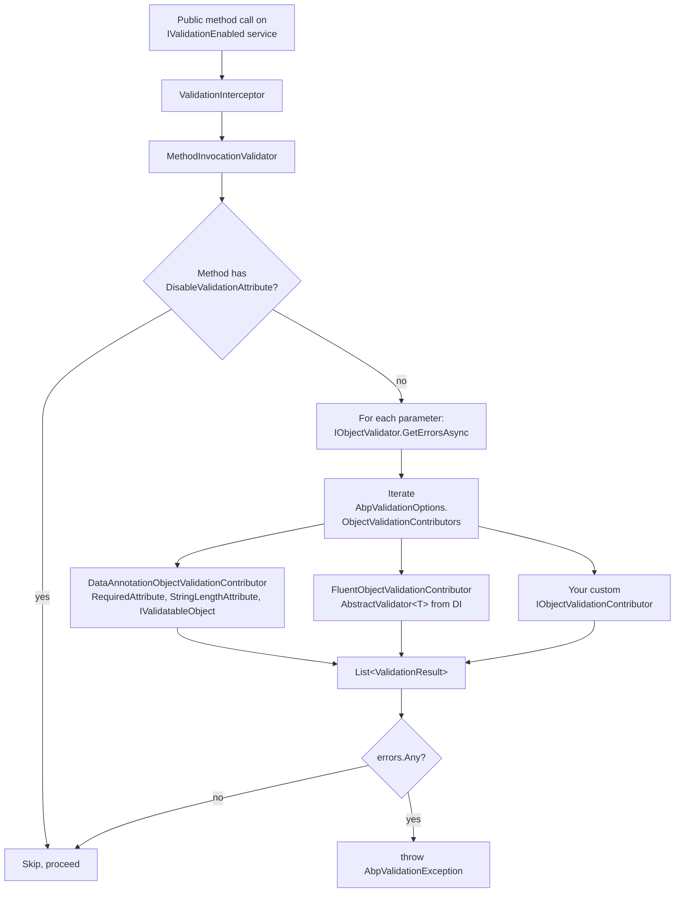
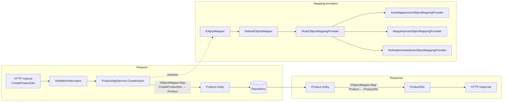

ABP ships **validation** and **object mapping** as two thin abstractions that the rest of the framework — `ApplicationService`, MVC controllers, dynamic HTTP API proxies, and the audit-log filters — depends on. Both abstractions follow the same playbook: a small `Volo.Abp.*` core package defines interfaces and a default implementation, and integration packages (`Volo.Abp.FluentValidation`, `Volo.Abp.AutoMapper`, `Volo.Abp.Mapperly`) plug in third-party engines through a single seam.

This section documents the validation pipeline first, then revisits object mapping from the **validation angle**: where mapped DTOs enter the validation interceptor, how extra-properties are mapped after entity → DTO conversion, and how AutoMapper / Mapperly co-exist with FluentValidation.

For the day-to-day mapping API (`IObjectMapper.Map<TSource, TDestination>`, `IMapFrom`/`IMapTo`, profile registration) see the dedicated pages under [DDD Building Blocks](/ddd/object-mapping).

## When to read which page

<CardGroup cols={2}>
  <Card title="Validation core" icon="shield-check" href="/validation/validation-core">
    `Volo.Abp.Validation` + `Volo.Abp.Validation.Abstractions`. `AbpValidationModule`, `IMethodInvocationValidator`, `IObjectValidator`, `IObjectValidationContributor`, `[DisableValidation]`, `AbpValidationException`.
  </Card>
  <Card title="FluentValidation integration" icon="feather" href="/validation/fluent-validation">
    `Volo.Abp.FluentValidation` adds a `FluentObjectValidationContributor` so `AbstractValidator<T>` classes are picked up automatically by the same `IObjectValidator` pipeline.
  </Card>
  <Card title="Object-mapping core (recap)" icon="arrows-left-right" href="/validation/object-mapping-core">
    Quick recap of `IObjectMapper` and `IAutoObjectMappingProvider` with focus on how mapped DTOs flow into the validation interceptor and how extra properties survive the mapping.
  </Card>
  <Card title="AutoMapper integration" icon="map" href="/validation/automapper-integration">
    `AbpAutoMapperModule`, `IAbpAutoMapperConfigurationContext.MapperConfiguration`, profile validation (`ValidatingProfiles`) and the interplay with FluentValidation.
  </Card>
  <Card title="Mapperly integration" icon="bolt" href="/validation/mapperly-integration">
    `AbpMapperlyModule`, `MapperBase<TSource, TDestination>` and `IAbpMapperlyMapper<,>` — a source-generator-driven alternative with zero runtime configuration.
  </Card>
  <Card title="Exception handling" icon="triangle-exclamation" href="/core/exception-handling">
    `AbpValidationException` is `IHasLogLevel` + `IHasValidationErrors` + `IExceptionWithSelfLogging`. The remote-service exception filter projects it as a 400-class response.
  </Card>
</CardGroup>

## A typical request, traced

A single line of code — `await productService.CreateAsync(dto)` — touches every component in this section. Here is what happens, in order, when an MVC controller (or a dynamic API proxy on the client) calls into a `ProductAppService.CreateAsync(CreateProductDto)`:

<Steps>
  <Step title="DynamicProxy intercept">
    `ProductAppService` derives from `ApplicationService`, which implements `IValidationEnabled`. At service-registration time, `AbpValidationModule.PreConfigureServices` called `services.OnRegistered(ValidationInterceptorRegistrar.RegisterIfNeeded)` — that registrar attached `ValidationInterceptor` to the service. The intercept fires *before* the method body.
  </Step>
  <Step title="MethodInvocationValidator runs">
    The interceptor builds a `MethodInvocationValidationContext(targetObject, method, arguments)` and hands it to `IMethodInvocationValidator.ValidateAsync`. The default implementation skips non-public methods, checks for `[DisableValidation]`, and then iterates parameters.
  </Step>
  <Step title="IObjectValidator runs the contributor chain">
    For each parameter, `ObjectValidator.GetErrorsAsync(value, name, allowNull)` creates a per-call `IServiceScope` and loops every `IObjectValidationContributor` registered in `AbpValidationOptions.ObjectValidationContributors`. `DataAnnotationObjectValidationContributor` runs first (DataAnnotations + `IValidatableObject`), then `FluentObjectValidationContributor` if `Volo.Abp.FluentValidation` is referenced.
  </Step>
  <Step title="Errors aggregated">
    Both contributors append `System.ComponentModel.DataAnnotations.ValidationResult` instances to the shared list. The pipeline does not short-circuit on the first error — you get the full set.
  </Step>
  <Step title="If clean: method body executes">
    The interceptor calls `invocation.ProceedAsync()`. Inside the body, `ObjectMapper.Map<CreateProductDto, Product>(input)` calls `DefaultObjectMapper`, which checks for a manual `IObjectMapper<,>`, an `IMapTo<,>`, an `IMapFrom<,>`, and finally falls through to `IAutoObjectMappingProvider` — the AutoMapper or Mapperly engine.
  </Step>
  <Step title="If broken: AbpValidationException">
    The interceptor throws `AbpValidationException("Method arguments are not valid!", errors)`. The exception filter ([Exception handling](/core/exception-handling)) projects it as a structured 400 response containing `validationErrors[]`.
  </Step>
</Steps>

This sequence is identical whether the entry point is an MVC controller, a Blazor circuit, a background worker, or an in-process service call — because the interception lives on the application service itself, not on the HTTP layer.

## What the validation pipeline actually does

When ABP intercepts a public method on a service that implements `IValidationEnabled` (the marker interface that `ApplicationService` implements via `ICrudAppService`), it builds a `MethodInvocationValidationContext`, walks every parameter, and asks every registered `IObjectValidationContributor` to add errors. If any errors come back, the interceptor throws `AbpValidationException` instead of letting the method run.



The shape is deliberate: validation is **not** baked into MVC's model-binding stage — it runs inside the ABP interceptor pipeline so the *same* contributors fire regardless of how the method was invoked (HTTP, gRPC, background job, in-process call).

## Where object mapping fits

Application services usually map entities to DTOs (and DTOs to entities). The mapping happens **inside** the method, after validation has already approved the input DTO and before the result DTO is returned.



The grey **Mapping providers** subgraph is exactly what the [Object Mapping](/ddd/object-mapping) page documents in detail. From the validation angle, three properties matter:

1. **DTOs are validated, entities are not.** Validation runs against the inbound DTO *before* mapping; the framework never re-validates the entity after `Map<TSource, TDestination>`.
2. **`IHasExtraProperties` survives mapping.** Both `AutoMapperAutoObjectMappingProvider` (via `MapExtraProperties` extension) and `MapperlyAutoObjectMappingProvider` (via `[MapExtraProperties]`) copy the dynamic dictionary; validation contributors should treat extra props as opaque.
3. **Manual mappers (`IObjectMapper<TSource, TDestination>`) bypass the auto provider entirely.** That means any "fix up" logic you put there (defaults, normalisation, trimming) runs *after* the validation pipeline has approved the source DTO.

## Package layout

| Package | Folder | Purpose |
| --- | --- | --- |
| `Volo.Abp.Validation.Abstractions` | `framework/src/Volo.Abp.Validation.Abstractions/` | `AbpValidationException`, `IHasValidationErrors`, `ValidationHelper`. No DI, no module dependencies — safe for `Domain.Shared`. |
| `Volo.Abp.Validation` | `framework/src/Volo.Abp.Validation/` | `AbpValidationModule`, `IObjectValidator`/`ObjectValidator`, `IMethodInvocationValidator`/`MethodInvocationValidator`, `DataAnnotationObjectValidationContributor`, the DynamicProxy `ValidationInterceptor`. |
| `Volo.Abp.FluentValidation` | `framework/src/Volo.Abp.FluentValidation/` | `AbpFluentValidationModule`, `FluentObjectValidationContributor`, `AbpFluentValidationConventionalRegistrar` (registers `AbstractValidator<T>` types as `IValidator<T>`). |
| `Volo.Abp.ObjectMapping` | `framework/src/Volo.Abp.ObjectMapping/` | `IObjectMapper`, `DefaultObjectMapper`, `IAutoObjectMappingProvider`, `IMapFrom`/`IMapTo`. |
| `Volo.Abp.AutoMapper` | `framework/src/Volo.Abp.AutoMapper/` | `AbpAutoMapperModule`, `IAbpAutoMapperConfigurationContext`, `AutoMapperAutoObjectMappingProvider`. |
| `Volo.Abp.Mapperly` | `framework/src/Volo.Abp.Mapperly/` | `AbpMapperlyModule`, `MapperBase<,>`, `IAbpMapperlyMapper<,>`, `MapperlyAutoObjectMappingProvider`. |

`Volo.Abp.Validation.Abstractions` is intentionally tiny — it can be referenced from `Domain.Shared` projects that must throw `AbpValidationException` without taking on `AbpValidationModule` or the localization stack.

## How to choose your stack

<Tabs>
  <Tab title="DataAnnotations only">
    Just take `[DependsOn(typeof(AbpValidationModule))]` (which `Volo.Abp.Ddd.Application.Contracts` already does transitively). `[Required]`, `[StringLength]`, `[Range]`, `IValidatableObject` all work out of the box through `DataAnnotationObjectValidationContributor`.
  </Tab>
  <Tab title="FluentValidation">
    Add `Volo.Abp.FluentValidation` to your `Application.Contracts` or `Application` module. Define `public class CreateProductDtoValidator : AbstractValidator<CreateProductDto>` — the conventional registrar exposes it as `IValidator<CreateProductDto>` automatically, and `FluentObjectValidationContributor` calls it during the same pipeline pass. **DataAnnotations are *not* turned off** — both contributors run.
  </Tab>
  <Tab title="Custom contributor">
    Implement `IObjectValidationContributor` and register it as a transient service. `AbpValidationModule.PreConfigureServices` enumerates every implementation through `services.OnRegistered` and adds it to `AbpValidationOptions.ObjectValidationContributors` automatically — you don't have to touch the options object.
  </Tab>
</Tabs>

## A custom contributor end-to-end

To make the moving parts concrete: here is a complete cross-cutting validator that enforces a tenant-level quota on every DTO that implements a marker interface. No options-configuration is needed — `AbpValidationModule` discovers contributors automatically.

```csharp
// 1. Marker that any quota-aware DTO implements.
public interface IConsumesTenantQuota
{
    int RequestedUnits { get; }
}

// 2. Annotate the DTO. The [Required] etc. still apply via DataAnnotations.
public class CreateProductBatchDto : IConsumesTenantQuota
{
    [Required, MinLength(1)]
    public List<CreateProductDto> Products { get; set; } = new();

    public int RequestedUnits => Products?.Count ?? 0;
}

// 3. The contributor itself.
public class TenantQuotaValidationContributor : IObjectValidationContributor, ITransientDependency
{
    private readonly ITenantQuotaService _quota;
    private readonly ICurrentTenant _currentTenant;

    public TenantQuotaValidationContributor(
        ITenantQuotaService quota,
        ICurrentTenant currentTenant)
    {
        _quota = quota;
        _currentTenant = currentTenant;
    }

    public async Task AddErrorsAsync(ObjectValidationContext context)
    {
        if (context.ValidatingObject is not IConsumesTenantQuota quotaUser) return;
        if (_currentTenant.Id is null) return; // host-side calls bypass quota

        var remaining = await _quota.GetRemainingAsync(_currentTenant.Id.Value);
        if (quotaUser.RequestedUnits > remaining)
        {
            context.Errors.Add(new ValidationResult(
                $"Tenant quota exceeded: requested {quotaUser.RequestedUnits}, remaining {remaining}.",
                new[] { nameof(IConsumesTenantQuota.RequestedUnits) }));
        }
    }
}
```

The instant `TenantQuotaValidationContributor` is in your module's assembly:

1. `AbpValidationModule.AutoAddObjectValidationContributors` discovers it during the `OnRegistered` callback.
2. Every call to a public `IValidationEnabled` method that takes an `IConsumesTenantQuota` parameter passes through the contributor.
3. Quota breaches surface as `AbpValidationException` — the same shape the UI already handles.

No `Configure<AbpValidationOptions>` call is required. The framework's discovery convention does the wiring.

## Where this section does *not* go

This section covers the **framework-level pipeline**. It does not cover:

- **MVC model state.** ABP layers its own filter on top of MVC, but the bridge between `ModelState` and `AbpValidationException` is documented in [MVC controllers & conventions](/aspnetcore/mvc-controllers-and-conventions).
- **Background job / event bus validation.** The same `ValidationInterceptor` applies because event handlers and background workers also flow through ABP DynamicProxy.
- **Authorization & rate limiting.** Those run through their own interceptors and are documented elsewhere.

## Two abstractions, one philosophy

The validation pipeline and the object-mapping pipeline are designed around the same shape:

| Concern | Validation | Object mapping |
| --- | --- | --- |
| Abstraction package | `Volo.Abp.Validation.Abstractions` | `Volo.Abp.ObjectMapping` (no separate abstractions package) |
| Default implementation | `ObjectValidator` (calls `IObjectValidationContributor` chain) | `DefaultObjectMapper` (resolves manual `IObjectMapper<,>` then auto provider) |
| Extension seam | `IObjectValidationContributor` | `IAutoObjectMappingProvider` |
| First-party plugins | `Volo.Abp.Validation` (DataAnnotations), `Volo.Abp.FluentValidation` | `Volo.Abp.AutoMapper`, `Volo.Abp.Mapperly` |
| Manual escape hatch | Implement `IObjectValidationContributor` and register it | Implement `IObjectMapper<TSource, TDestination>`, `IMapTo<,>`, or `IMapFrom<,>` |
| Pipeline trigger | DynamicProxy intercepts `IValidationEnabled` | `ApplicationService.ObjectMapper.Map<,>` (or any DI consumer of `IObjectMapper`) |
| Failure | `AbpValidationException` (HTTP 400) | `AutoMapperMappingException` / `AbpException` (HTTP 500-class) |

The same `OnRegistered` discovery trick (used by `AbpValidationModule` to find contributors) also exists in the mapping side (`AbpObjectMappingModule.OnExposing` adds `IObjectMapper<TSource, TDestination>` interfaces to the exposed-types list). Once you grok one, the other clicks immediately.

## A "do I need to write a contributor?" decision tree

<Steps>
  <Step title="Is the rule expressible as a DataAnnotation?">
    Use `[Required]`, `[StringLength]`, `[Range]`, `[EmailAddress]`, etc. on the DTO property. No code needed. `DataAnnotationObjectValidationContributor` ships with the core module.
  </Step>
  <Step title="Is the rule a cross-field check on the same DTO?">
    Implement `IValidatableObject` on the DTO. `DataAnnotationObjectValidationContributor` calls `Validate()` after attribute validation.
  </Step>
  <Step title="Do you want a fluent rule DSL with rich condition support?">
    Add `Volo.Abp.FluentValidation` and write `public class FooDtoValidator : AbstractValidator<FooDto>`. The [FluentValidation page](/validation/fluent-validation) covers the details.
  </Step>
  <Step title="Does the rule need cross-cutting context (every DTO, regardless of type)?">
    Implement `IObjectValidationContributor`. Example: enforce tenant quotas on any DTO that implements a marker interface. See [Validation core](/validation/validation-core).
  </Step>
  <Step title="Should the rule live in the domain instead?">
    Domain invariants (e.g. "a Booking cannot end before it starts") belong on the entity, not the DTO. Throw `BusinessException` from the entity constructor and let the [exception handler](/core/exception-handling) project it.
  </Step>
</Steps>

## What to read next

<CardGroup cols={2}>
  <Card title="Validation core" href="/validation/validation-core">
    Start here. The interceptor, the validator and the contributors with full source.
  </Card>
  <Card title="FluentValidation" href="/validation/fluent-validation">
    Add `AbstractValidator<T>` support in three lines.
  </Card>
  <Card title="Object Mapping (DDD)" href="/ddd/object-mapping">
    The complete mapping API.
  </Card>
  <Card title="Exception handling" href="/core/exception-handling">
    How `AbpValidationException` becomes a 400 response.
  </Card>
  <Card title="AutoMapper integration" href="/validation/automapper-integration">
    Profile-driven mapping and its interaction with validation.
  </Card>
  <Card title="Mapperly integration" href="/validation/mapperly-integration">
    Compile-time mapping for AOT-friendly hosts.
  </Card>
</CardGroup>

## Common questions

<AccordionGroup>
  <Accordion title="Does the validation interceptor run on private/protected methods?">
    No. `MethodInvocationValidator.ValidateAsync` checks `context.Method.IsPublic` and short-circuits if false. Validation is a *public surface* contract, not an internal invariant — for internals, use guard clauses in the method body or domain-level checks.
  </Accordion>
  <Accordion title="Why is `Volo.Abp.Validation.Abstractions` separate?">
    So that `Domain.Shared` modules can throw `AbpValidationException` without taking a dependency on `AbpValidationModule` (which itself depends on `AbpLocalizationModule`, embedded resources, etc.). The abstractions assembly is the minimal surface the rest of the framework needs to catch and project the exception.
  </Accordion>
  <Accordion title="Does mapping ever run before validation?">
    Not in the standard application-service flow. The interceptor sits in front of the method body; the body is where `IObjectMapper.Map` is called. If you call `IObjectMapper.Map` from a place that is *not* an `IValidationEnabled` method (e.g. a raw `IHostedService`), validation has not run — you would need to call `IObjectValidator.ValidateAsync(input)` explicitly first.
  </Accordion>
  <Accordion title="Can I disable a single contributor for one DTO?">
    Not at the contributor level — contributors run for every parameter. The cleanest options are: (1) put `[DisableValidation]` on the method, (2) gate inside the contributor on a type check (`if (context.ValidatingObject is not IConsumesTenantQuota) return;`), or (3) remove the contributor from `AbpValidationOptions.ObjectValidationContributors` globally if you never want it.
  </Accordion>
</AccordionGroup>

## A note on this section's scope

These pages document the **framework** packages under `framework/src/`:

- `Volo.Abp.Validation`, `Volo.Abp.Validation.Abstractions`
- `Volo.Abp.FluentValidation`
- `Volo.Abp.ObjectMapping` (recap)
- `Volo.Abp.AutoMapper` (recap)
- `Volo.Abp.Mapperly` (recap)

They do not cover application-module-specific validation (e.g. `Volo.Abp.Identity.Pro` password rules), UI-layer validation (the Blazor/MVC client-side projections), or HTTP API model-state binding. Those layers consume the same `IObjectValidator` and the same `AbpValidationException`, but the *invocation* sites differ — see [MVC controllers & conventions](/aspnetcore/mvc-controllers-and-conventions) for the HTTP layer, and the relevant UI-stack pages for client-side.
