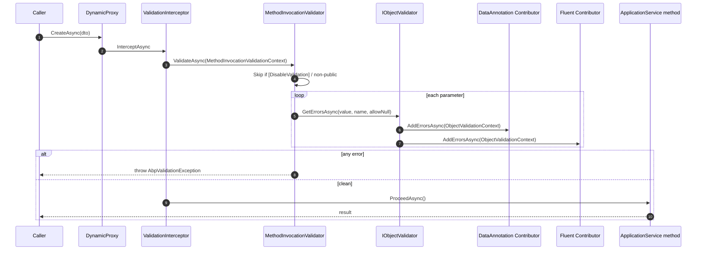

`Volo.Abp.Validation` is the package that hooks `System.ComponentModel.DataAnnotations`, `IValidatableObject`, and any custom validator into ABP's DynamicProxy interceptor pipeline. It is the package every `ApplicationService` ends up depending on transitively — whenever you call a public method on a service that implements `IValidationEnabled`, this code runs.

The package is intentionally split:

- `Volo.Abp.Validation.Abstractions` (`framework/src/Volo.Abp.Validation.Abstractions/`) defines `AbpValidationException`, `IHasValidationErrors` and `ValidationHelper`. Zero DI, zero localization — safe to reference from `Domain.Shared`.
- `Volo.Abp.Validation` (`framework/src/Volo.Abp.Validation/`) defines the module, the interceptor, the contributors and the default `ObjectValidator`.

## Folder map

```
framework/src/Volo.Abp.Validation.Abstractions/Volo/Abp/Validation/
├── AbpValidationAbstractionsModule.cs
├── AbpValidationException.cs
├── IHasValidationErrors.cs
└── ValidationHelper.cs

framework/src/Volo.Abp.Validation/Volo/Abp/Validation/
├── AbpValidationModule.cs
├── AbpValidationOptions.cs
├── AbpValidationResult.cs
├── DataAnnotationObjectValidationContributor.cs
├── DefaultAttributeValidationResultProvider.cs
├── DisableValidationAttribute.cs
├── EnableValidationAttribute.cs
├── HasValidationErrorsExtensions.cs
├── IAbpValidationResult.cs
├── IAttributeValidationResultProvider.cs
├── IMethodInvocationValidator.cs
├── IObjectValidationContributor.cs
├── IObjectValidator.cs
├── IValidationEnabled.cs
├── MethodInvocationValidationContext.cs
├── MethodInvocationValidator.cs
├── ObjectValidationContext.cs
├── ObjectValidator.cs
├── ValidationInterceptor.cs
└── ValidationInterceptorRegistrar.cs
```

## The pipeline at a glance



## AbpValidationModule

```csharp
// framework/src/Volo.Abp.Validation/Volo/Abp/Validation/AbpValidationModule.cs
[DependsOn(
    typeof(AbpValidationAbstractionsModule),
    typeof(AbpLocalizationModule)
)]
public class AbpValidationModule : AbpModule
{
    public override void PreConfigureServices(ServiceConfigurationContext context)
    {
        context.Services.OnRegistered(ValidationInterceptorRegistrar.RegisterIfNeeded);
        AutoAddObjectValidationContributors(context.Services);
    }

    public override void ConfigureServices(ServiceConfigurationContext context)
    {
        Configure<AbpVirtualFileSystemOptions>(options =>
        {
            options.FileSets.AddEmbedded<AbpValidationResource>();
        });

        Configure<AbpLocalizationOptions>(options =>
        {
            options.Resources
                .Add<AbpValidationResource>("en")
                .AddVirtualJson("/Volo/Abp/Validation/Localization");
        });
    }

    private static void AutoAddObjectValidationContributors(IServiceCollection services)
    {
        var contributorTypes = new List<Type>();

        services.OnRegistered(context =>
        {
            if (typeof(IObjectValidationContributor).IsAssignableFrom(context.ImplementationType))
            {
                contributorTypes.Add(context.ImplementationType);
            }
        });

        services.Configure<AbpValidationOptions>(options =>
        {
            options.ObjectValidationContributors.AddIfNotContains(contributorTypes);
        });
    }
}
```

Two `OnRegistered` callbacks do the heavy lifting:

1. **`ValidationInterceptorRegistrar.RegisterIfNeeded`** attaches `ValidationInterceptor` to every service whose implementation type satisfies `IValidationEnabled`. `ApplicationService` implements `IValidationEnabled`, which is why every app service is automatically intercepted.
2. **`AutoAddObjectValidationContributors`** scans every registered service and, if it implements `IObjectValidationContributor`, adds the type to `AbpValidationOptions.ObjectValidationContributors`. This is how `DataAnnotationObjectValidationContributor` and `FluentObjectValidationContributor` end up in the pipeline without anybody calling `AddIfNotContains` by hand.

<Note>
`AbpValidationModule` depends on `AbpLocalizationModule` because the embedded `AbpValidationResource` ships translated strings for the built-in error messages. If you are wiring `Volo.Abp.Validation` in isolation (for example, in a console host) make sure your final module depends on `AbpLocalizationModule` too — `AbpValidationModule`'s `[DependsOn]` already covers it transitively.
</Note>

## AbpValidationOptions

```csharp
// framework/src/Volo.Abp.Validation/Volo/Abp/Validation/AbpValidationOptions.cs
public class AbpValidationOptions
{
    public List<Type> IgnoredTypes { get; }

    public ITypeList<IObjectValidationContributor> ObjectValidationContributors { get; set; }

    public AbpValidationOptions()
    {
        IgnoredTypes = new List<Type>();
        ObjectValidationContributors = new TypeList<IObjectValidationContributor>();
    }
}
```

- `IgnoredTypes` is checked by `DataAnnotationObjectValidationContributor` before it recurses into a value's properties. Use it for known "data bag" types (e.g. a third-party SDK request DTO) you do not want walked.
- `ObjectValidationContributors` is auto-populated as described above. You normally do not touch it manually unless you want to control ordering, in which case `Configure<AbpValidationOptions>` in your module's `ConfigureServices` after `base` has already added the defaults.

```csharp
// Re-order so your custom contributor runs FIRST
Configure<AbpValidationOptions>(options =>
{
    options.ObjectValidationContributors.Remove<MyTenantQuotaValidationContributor>();
    options.ObjectValidationContributors.Insert(0, typeof(MyTenantQuotaValidationContributor));
});
```

## IObjectValidator / ObjectValidator

```csharp
// framework/src/Volo.Abp.Validation/Volo/Abp/Validation/IObjectValidator.cs
public interface IObjectValidator
{
    Task ValidateAsync(
        object? validatingObject,
        string? name = null,
        bool allowNull = false
    );

    Task<List<ValidationResult>> GetErrorsAsync(
        object? validatingObject,
        string? name = null,
        bool allowNull = false
    );
}
```

`IObjectValidator` is the entry point you call from your own code when you want to validate an arbitrary object (e.g. inside a domain service before persisting). It is registered as `ITransientDependency` and resolves to `ObjectValidator`.

```csharp
// framework/src/Volo.Abp.Validation/Volo/Abp/Validation/ObjectValidator.cs (excerpt)
public class ObjectValidator : IObjectValidator, ITransientDependency
{
    protected IServiceScopeFactory ServiceScopeFactory { get; }
    protected AbpValidationOptions Options { get; }

    public virtual async Task ValidateAsync(object? validatingObject, string? name = null, bool allowNull = false)
    {
        var errors = await GetErrorsAsync(validatingObject, name, allowNull);

        if (errors.Any())
        {
            throw new AbpValidationException(
                "Object state is not valid! See ValidationErrors for details.",
                errors
            );
        }
    }

    public virtual async Task<List<ValidationResult>> GetErrorsAsync(object? validatingObject, string? name = null, bool allowNull = false)
    {
        if (validatingObject == null)
        {
            if (allowNull)
            {
                return new List<ValidationResult>();
            }
            else
            {
                return new List<ValidationResult>
                {
                    name == null
                        ? new ValidationResult("Given object is null!")
                        : new ValidationResult(name + " is null!", new[] {name})
                };
            }
        }

        var context = new ObjectValidationContext(validatingObject);

        using (var scope = ServiceScopeFactory.CreateScope())
        {
            foreach (var contributorType in Options.ObjectValidationContributors)
            {
                var contributor = (IObjectValidationContributor)
                    scope.ServiceProvider.GetRequiredService(contributorType);
                await contributor.AddErrorsAsync(context);
            }
        }

        return context.Errors;
    }
}
```

Three things to notice:

1. A **fresh `IServiceScope`** is created per call. Contributors can take scoped dependencies (current tenant, current user, DbContext) without leaking state across calls.
2. The contributors run **in registration order**. The first contributor to add an error does not short-circuit the rest — you always get the full list.
3. Null handling is centralised here. `allowNull = true` returns an empty list; `allowNull = false` produces a `"<name> is null!"` error with the parameter name as the member name.

## IMethodInvocationValidator / MethodInvocationValidator

```csharp
// framework/src/Volo.Abp.Validation/Volo/Abp/Validation/IMethodInvocationValidator.cs
public interface IMethodInvocationValidator
{
    Task ValidateAsync(MethodInvocationValidationContext context);
}
```

```csharp
// framework/src/Volo.Abp.Validation/Volo/Abp/Validation/MethodInvocationValidationContext.cs
public class MethodInvocationValidationContext : AbpValidationResult
{
    public object? TargetObject { get; }
    public MethodInfo Method { get; }
    public object?[] ParameterValues { get; }
    public ParameterInfo[] Parameters { get; }

    public MethodInvocationValidationContext(object? targetObject, MethodInfo method, object?[] parameterValues)
    {
        TargetObject = targetObject;
        Method = method;
        ParameterValues = parameterValues;
        Parameters = method.GetParameters();
    }
}
```

The default `MethodInvocationValidator` (`framework/src/Volo.Abp.Validation/Volo/Abp/Validation/MethodInvocationValidator.cs`) iterates parameters and delegates each one to `IObjectValidator`:

```csharp
public virtual async Task ValidateAsync(MethodInvocationValidationContext context)
{
    Check.NotNull(context, nameof(context));

    if (context.Parameters.IsNullOrEmpty()) return;
    if (!context.Method.IsPublic) return;
    if (IsValidationDisabled(context)) return;

    if (context.Parameters.Length != context.ParameterValues.Length)
    {
        throw new Exception("Method parameter count does not match with argument count!");
    }

    if (context.Errors.Any() && HasSingleNullArgument(context))
    {
        ThrowValidationError(context);
    }

    await AddMethodParameterValidationErrorsAsync(context);

    if (context.Errors.Any())
    {
        ThrowValidationError(context);
    }
}

protected virtual async Task AddMethodParameterValidationErrorsAsync(
    IAbpValidationResult context,
    ParameterInfo parameterInfo,
    object? parameterValue)
{
    var allowNulls = parameterInfo.IsOptional ||
                     parameterInfo.IsOut ||
                     TypeHelper.IsNullable(parameterInfo.ParameterType) ||
                     TypeHelper.IsPrimitiveExtended(parameterInfo.ParameterType, includeEnums: true);

    context.Errors.AddRange(
        await _objectValidator.GetErrorsAsync(
            parameterValue,
            parameterInfo.Name,
            allowNulls
        )
    );
}
```

Highlights:

- **Non-public methods are skipped.** Only public surface is validated — internal helpers on the same class run unguarded.
- **`allowNulls` is computed per parameter.** Optional parameters, `out` parameters, `Nullable<T>` and primitives all allow null because there is no reasonable error to raise when a value type is "absent".
- **All parameters are validated before throwing.** You get the union of every contributor's errors in one `AbpValidationException`.

### ValidationInterceptor

```csharp
// framework/src/Volo.Abp.Validation/Volo/Abp/Validation/ValidationInterceptor.cs
public class ValidationInterceptor : AbpInterceptor, ITransientDependency
{
    private readonly IMethodInvocationValidator _methodInvocationValidator;

    public override async Task InterceptAsync(IAbpMethodInvocation invocation)
    {
        await ValidateAsync(invocation);
        await invocation.ProceedAsync();
    }

    protected virtual async Task ValidateAsync(IAbpMethodInvocation invocation)
    {
        await _methodInvocationValidator.ValidateAsync(
            new MethodInvocationValidationContext(
                invocation.TargetObject,
                invocation.Method,
                invocation.Arguments
            )
        );
    }
}
```

And the registrar that attaches it conditionally:

```csharp
// framework/src/Volo.Abp.Validation/Volo/Abp/Validation/ValidationInterceptorRegistrar.cs
public static class ValidationInterceptorRegistrar
{
    public static void RegisterIfNeeded(IOnServiceRegistredContext context)
    {
        if (ShouldIntercept(context.ImplementationType))
        {
            context.Interceptors.TryAdd<ValidationInterceptor>();
        }
    }

    private static bool ShouldIntercept(Type type)
    {
        return !DynamicProxyIgnoreTypes.Contains(type) && typeof(IValidationEnabled).IsAssignableFrom(type);
    }
}
```

The `IValidationEnabled` marker is empty:

```csharp
// framework/src/Volo.Abp.Validation/Volo/Abp/Validation/IValidationEnabled.cs
public interface IValidationEnabled
{
}
```

`ApplicationService` implements it. So does anything that implements `ICrudAppService<...>`. If you want a non-app-service class (e.g. a domain service) intercepted, implement `IValidationEnabled` on it.

## IObjectValidationContributor

```csharp
// framework/src/Volo.Abp.Validation/Volo/Abp/Validation/IObjectValidationContributor.cs
public interface IObjectValidationContributor
{
    Task AddErrorsAsync(ObjectValidationContext context);
}

// framework/src/Volo.Abp.Validation/Volo/Abp/Validation/ObjectValidationContext.cs
public class ObjectValidationContext
{
    [NotNull]
    public object ValidatingObject { get; }
    public List<ValidationResult> Errors { get; }

    public ObjectValidationContext([NotNull] object validatingObject)
    {
        ValidatingObject = Check.NotNull(validatingObject, nameof(validatingObject));
        Errors = new List<ValidationResult>();
    }
}
```

A contributor receives the object being validated and an error list; it appends `System.ComponentModel.DataAnnotations.ValidationResult` instances. Anything you can express as `ValidationResult` is a first-class citizen — both DataAnnotations and the FluentValidation bridge use the same type.

### DataAnnotationObjectValidationContributor

This is the default that ships with `AbpValidationModule`. It walks the object's properties, applies every `ValidationAttribute`, and recurses into nested objects up to `MaxRecursiveParameterValidationDepth = 8`.

```csharp
// framework/src/Volo.Abp.Validation/Volo/Abp/Validation/DataAnnotationObjectValidationContributor.cs (excerpt)
public class DataAnnotationObjectValidationContributor : IObjectValidationContributor, ITransientDependency
{
    public const int MaxRecursiveParameterValidationDepth = 8;

    public Task AddErrorsAsync(ObjectValidationContext context)
    {
        ValidateObjectRecursively(context.Errors, context.ValidatingObject, currentDepth: 1);
        return Task.CompletedTask;
    }

    protected virtual void ValidateObjectRecursively(List<ValidationResult> errors, object? validatingObject, int currentDepth)
    {
        if (currentDepth > MaxRecursiveParameterValidationDepth) return;
        if (validatingObject == null) return;

        AddErrors(errors, validatingObject);

        // Validate items of enumerable
        if (validatingObject is IEnumerable enumerable)
        {
            if (!(enumerable is IQueryable))
            {
                foreach (var item in enumerable)
                {
                    if (item == null || TypeHelper.IsPrimitiveExtended(item.GetType()))
                    {
                        break;
                    }
                    ValidateObjectRecursively(errors, item, currentDepth + 1);
                }
            }
            return;
        }

        var validatingObjectType = validatingObject.GetType();
        if (TypeHelper.IsPrimitiveExtended(validatingObjectType)) return;
        if (Options.IgnoredTypes.Any(t => t.IsInstanceOfType(validatingObject))) return;

        var properties = TypeDescriptor.GetProperties(validatingObject).Cast<PropertyDescriptor>();
        foreach (var property in properties)
        {
            if (property.Attributes.OfType<DisableValidationAttribute>().Any())
            {
                continue;
            }
            ValidateObjectRecursively(errors, property.GetValue(validatingObject), currentDepth + 1);
        }
    }

    public void AddErrors(List<ValidationResult> errors, object validatingObject)
    {
        var properties = TypeDescriptor.GetProperties(validatingObject).Cast<PropertyDescriptor>();
        foreach (var property in properties)
        {
            AddPropertyErrors(validatingObject, property, errors);
        }

        if (validatingObject is IValidatableObject validatableObject)
        {
            errors.AddRange(
                validatableObject.Validate(new ValidationContext(validatableObject, ServiceProvider, null))
            );
        }
    }
}
```

Key behaviours:

- **Enumerables are walked element-by-element**, except `IQueryable` (which would be silly to enumerate) and primitive enumerables.
- **`[DisableValidation]` on a property** stops recursion into that property entirely.
- **`IValidatableObject.Validate`** is invoked with a `ValidationContext` that carries `IServiceProvider`, so your custom `Validate` method can resolve services.
- **`IgnoredTypes`** stops recursion into specific marker types.

### Using IValidatableObject

```csharp
public class CreatePromotionDto : IValidatableObject
{
    [Required, StringLength(120)]
    public string Name { get; set; } = default!;

    public DateTime StartsAt { get; set; }
    public DateTime EndsAt { get; set; }

    public IEnumerable<ValidationResult> Validate(ValidationContext validationContext)
    {
        if (EndsAt <= StartsAt)
        {
            yield return new ValidationResult(
                "EndsAt must be after StartsAt.",
                new[] { nameof(EndsAt) });
        }
    }
}
```

`DataAnnotationObjectValidationContributor` calls `Validate` *after* the property-level attributes have produced errors.

## AbpValidationResult / IAbpValidationResult

```csharp
// framework/src/Volo.Abp.Validation/Volo/Abp/Validation/IAbpValidationResult.cs
public interface IAbpValidationResult
{
    List<ValidationResult> Errors { get; }
}

// framework/src/Volo.Abp.Validation/Volo/Abp/Validation/AbpValidationResult.cs
public class AbpValidationResult : IAbpValidationResult
{
    public List<ValidationResult> Errors { get; }
    public AbpValidationResult() { Errors = new List<ValidationResult>(); }
}
```

`MethodInvocationValidationContext` derives from `AbpValidationResult` so the validator can `context.Errors.AddRange(...)` directly. You normally interact with `ValidationResult` (the .NET DataAnnotations type) and let ABP move it around.

## AbpValidationException

Lives in `Volo.Abp.Validation.Abstractions` so it can be thrown from `Domain.Shared`:

```csharp
// framework/src/Volo.Abp.Validation.Abstractions/Volo/Abp/Validation/AbpValidationException.cs (excerpt)
public class AbpValidationException : AbpException,
    IHasLogLevel,
    IHasValidationErrors,
    IExceptionWithSelfLogging
{
    public IList<ValidationResult> ValidationErrors { get; }
    public LogLevel LogLevel { get; set; }

    public AbpValidationException(string message, IList<ValidationResult> validationErrors)
        : base(message)
    {
        ValidationErrors = validationErrors;
        LogLevel = LogLevel.Warning;
    }

    public void Log(ILogger logger)
    {
        if (ValidationErrors.IsNullOrEmpty()) return;

        var validationErrors = new StringBuilder();
        validationErrors.AppendLine("There are " + ValidationErrors.Count + " validation errors:");
        foreach (var validationResult in ValidationErrors)
        {
            var memberNames = "";
            if (validationResult.MemberNames != null && validationResult.MemberNames.Any())
            {
                memberNames = " (" + string.Join(", ", validationResult.MemberNames) + ")";
            }
            validationErrors.AppendLine(validationResult.ErrorMessage + memberNames);
        }
        logger.LogWithLevel(LogLevel, validationErrors.ToString());
    }
}
```

Three interfaces matter:

- **`IHasValidationErrors`** — exposes `ValidationErrors`. ABP's MVC exception filter (see [MVC controllers & conventions](/aspnetcore/mvc-controllers-and-conventions)) reads this to project the 400 response body.
- **`IHasLogLevel`** — defaults to `Warning`. Validation failures are not server errors.
- **`IExceptionWithSelfLogging`** — `Log(ILogger)` is invoked by ABP's exception subscriber so you get a single multi-line warning per failure instead of a generic stack trace.

### Throwing with the fluent helpers

```csharp
// framework/src/Volo.Abp.Validation/Volo/Abp/Validation/HasValidationErrorsExtensions.cs
public static class HasValidationErrorsExtensions
{
    public static TException WithValidationError<TException>(this TException exception, ValidationResult validationError)
        where TException : IHasValidationErrors { ... }

    public static TException WithValidationError<TException>(this TException exception, string errorMessage, params string[] memberNames)
        where TException : IHasValidationErrors
    {
        var validationResult = memberNames.IsNullOrEmpty()
            ? new ValidationResult(errorMessage)
            : new ValidationResult(errorMessage, memberNames);
        return exception.WithValidationError(validationResult);
    }
}
```

Use it for one-off domain validation:

```csharp
throw new AbpValidationException("Slug already in use")
    .WithValidationError("Slug must be unique.", nameof(CreateBlogDto.Slug));
```

See [Exception handling](/core/exception-handling) for how the global filter turns this into an HTTP response.

## Disabling validation

```csharp
// framework/src/Volo.Abp.Validation/Volo/Abp/Validation/DisableValidationAttribute.cs
[AttributeUsage(AttributeTargets.Method | AttributeTargets.Class | AttributeTargets.Property)]
public class DisableValidationAttribute : Attribute { }

// framework/src/Volo.Abp.Validation/Volo/Abp/Validation/EnableValidationAttribute.cs
[AttributeUsage(AttributeTargets.Method)]
public class EnableValidationAttribute : Attribute { }
```

`MethodInvocationValidator.IsValidationDisabled` walks the method, the declaring type and parent types using `ReflectionHelper.GetSingleAttributeOfMemberOrDeclaringTypeOrDefault<DisableValidationAttribute>`. `[EnableValidation]` on a method **wins** over `[DisableValidation]` on the class — useful when you want one whitelisted method on an otherwise unvalidated service.

```csharp
// Whole class opts out
[DisableValidation]
public class LegacyImportAppService : ApplicationService
{
    public Task ImportAsync(LegacyPayload payload) { ... } // not validated

    // ...but this one is
    [EnableValidation]
    public Task ImportValidatedAsync(LegacyPayload payload) { ... }
}
```

`[DisableValidation]` on a property tells `DataAnnotationObjectValidationContributor` to skip recursing into that property's value. It does **not** skip the attribute-level checks on the property itself (e.g. a `[Required]` directly on the property still fires) — it only stops the contributor from walking *into* the property value's own members.

## Calling IObjectValidator directly

When you need to validate something outside the interceptor pipeline — for example, a draft you build manually:

```csharp
public class PromotionsDraftService : DomainService
{
    private readonly IObjectValidator _objectValidator;

    public PromotionsDraftService(IObjectValidator objectValidator)
    {
        _objectValidator = objectValidator;
    }

    public async Task<Result> ReviewAsync(CreatePromotionDto draft)
    {
        var errors = await _objectValidator.GetErrorsAsync(draft, nameof(draft), allowNull: false);
        if (errors.Any())
        {
            return Result.Invalid(errors);
        }

        // ...
    }
}
```

Use `ValidateAsync` if you want it to throw, `GetErrorsAsync` if you want to inspect the list.

## Writing a custom IObjectValidationContributor

See the worked tenant-quota example on the [overview page](/validation/overview#a-custom-contributor-end-to-end). Key facts:

Implement `IObjectValidationContributor` and register transient (`ITransientDependency`); discovery is automatic via `AbpValidationModule.AutoAddObjectValidationContributors`. Append `ValidationResult` to `context.Errors` — do *not* throw, the pipeline aggregates errors.

## Related

<CardGroup cols={2}>
  <Card title="FluentValidation integration" href="/validation/fluent-validation">
    Add `AbstractValidator<T>` to the pipeline.
  </Card>
  <Card title="Exception handling" href="/core/exception-handling">
    How `AbpValidationException` becomes an HTTP response.
  </Card>
  <Card title="MVC controllers & conventions" href="/aspnetcore/mvc-controllers-and-conventions">
    The bridge between MVC's `ModelState` and the ABP pipeline.
  </Card>
  <Card title="Object mapping" href="/ddd/object-mapping">
    Mapping happens after validation succeeds.
  </Card>
</CardGroup>
